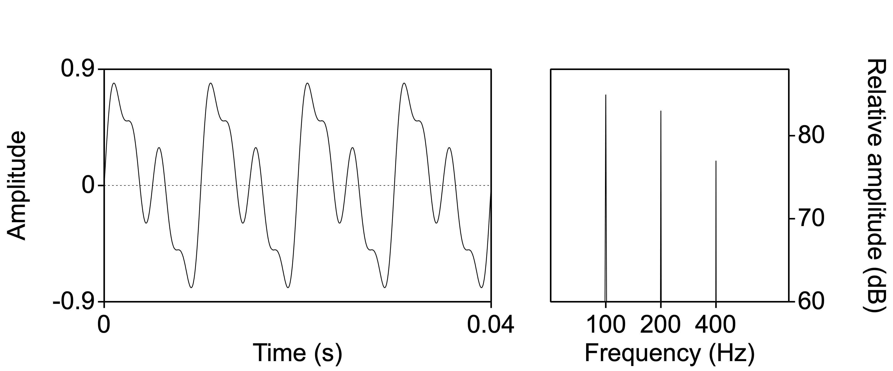
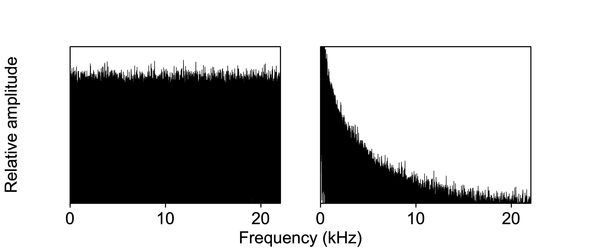

# (PART\*) Part I: Sounds {-}

# Sound waves {#ch-soundwaves}

*Chapter keywords*: sound, sound wave, oscillation, propagation, longitudinal wave, transverse wave, medium, speed of sound, force, pressure, Pascal, oscillogram, frequency, Hertz, period, periodic, aperiodic, fundamental frequency, octave, amplitude, intensity, phase, Pascal, `Praat`, object, visualization, picture, figure, harmonic, overtone, timbre, Fourier, spectrum, spectral envelope, noise, impulse.

## Sound

Sound is a type of energy that travels through a medium (such as air, water, or solid materials) in the form of waves. These sound waves are created by the vibration of objects, which causes the surrounding particles in the medium to move in a back-and-forth (oscillatory) motion. This movement, or vibration, or oscillation, transfers energy through the medium, creating waves of high and low pressure.

## Sound wave {#sec:soundwave}

A sound wave consists of pressure fluctuations caused by the molecules of the acoustic medium crowding together (compression) and moving apart (rarefaction). A sound wave is spread in all directions from the sound source; we could compare its propagation to that of a circular wave on the surface of a water basin. The molecules themselves move over a very short distance and do not travel along with the wave: instead, after the sound wave (the pressure fluctuation) has passed along, they go back to their equilibrium position. 

Sound in air is different from wind. In wind, or in air flow, the air particles move from one position to another (from equator to tropics, from lungs to mouth). In sound, however, there is no net movement of the air particles: the particles only move over a very small distance, and return to their equilibrium after the sound wave has passed. In sound waves, the distance of travel of the air molecules is only about $10^{-11}$ to $10^{-5}$ m, depending on the amplitude and frequency of the vibration (more about these key properties in §\@ref(sec:keypropertiessound) below). 
There are two kinds of waves (also depending on the acoustic medium). In *longitudinal* waves (such as sound waves) the back-and-forth displacement or movement of the medium's particles is in the same direction as the propagation of the wave. In *transverse* waves (such as the waves on the surface of a pond) the back-and-forth displacement of the water particles is perpendicular to the direction of propagation of the wave.  
A stadium wave provides a clear example of a transverse wave: a group of persons (the particles) starts the wave by standing up, rising their arms, sitting down, standing up again, and so on. The persons' action is directly followed by that of their neighbours on one side, who do the same and who are again followed by their next neighbours on their side, and so on, until the wave is travelling through the whole stadium. The persons' motion (up-down) is perpendicular to the propagation of the wave (left-right along the bench). 

Sound propagates in all dimensions through an acoustic medium, like an expanding sphere, which is indeed the theoretical model used to describe the sound wave propagation pattern. As the sound wave moves away from its source, more particles are involved in the pressure fluctuations. As a consequence, sound waves lose energy while travelling through the medium, as some of the energy is spent in moving increasingly more particles. Finally, sound is perceived as such when the sound wave spread by the sound source and travelling through the acoustic medium finally impinges upon the eardrum of the observer. 

## Acoustic media

Air is only one of the media through which sound can propagate. If your head is under water (as in a bath, pool, lake or sea), the water may carry sound waves from the sound source to your eardrums, and you do hear sounds. The propagation of sound waves is faster through liquids than through gases such as air: the closer the molecules of the medium (i.e. the higher its density), the higher the speed of sound in that medium. 

You can also put your ear to the ground in order to hear sounds propagated through the soil. The propagation of sound waves in solid soil is even faster than in liquids. Trying this out on dry sand on the beach, one observer noted hearing footsteps until about 25 m distant [@Minnaert_1970v2, §10].

## The speed of sound {#sec:speedofsound}

In air, the speed of sound (the speed of propagation of a sound wave, symbol $c$) is about 332 m/s at 0°C, about 343 m/s at 20°C, and 353 m/s at at 37°C [@Shadle_2010] (all for dry air at sea level). 
The speed of sound in a gas such as air is affected by only two parameters: 
- the ambient temperature of the gas (as shown in the numbers above), 
- the composition of the gas (its mixture and the density and  compressibility of its component gases), including its relative humidity: humid air holds more particles (of water), resulting in a slight increase of the speed of sound as relative humidity increases [@Harris_1971]^[For relative humidity >30% [@Harris_1971].]. 

In sea water, sound travels at about 1435 m/s, in concrete 3400 m/s, in iron (e.g. railroad tracks) about 5100 m/s. 

## Pressure {#sec:pressure}

Pressure is the amount of force on a surface. In physics, *force* is defined as an influence causing an object to accelerate. It is expressed in Newton units; a Newton is the amount of force that increases the velocity of a 1-kilogram object by one meter per second ($m/s$). *Pressure*, in turn, is defined as force per unit of area. It is measured in Pascal units, which correspond to Newton (N) per square meter ($1\ Pa = 1\ N/m^2$). 
Under normal conditions, atmospheric air pressure is centered at 1013.25 hPa (101325 Pa, an average value^[This is the standard unit of 1 atmosphere. The pressure is due to the Earth's gravition force on the Earth's atmosphere.] on a medium latitude at sea level, at 0°C), with normal meteorological fluctuations of about ± 5000 Pa. Sound wave fluctuations in air pressure are far smaller, ranging from about ±20 µPa (micropascal, or ±0.00002 Pa) at the lower threshold of hearing to about ±20 Pascal at the upper threshold of hearing. Even louder sounds, with variations in air pressure exceeding about ±20 Pascal, are painful and cause hearing damage.

::: {#questions-soundwaves .questionbox}

## Questions {-}

### Question 1.1 {-}

Explain why a sound wave loses energy the further it is spread from the oscillation source.

<details>
  <summary>Answer 1.1</summary>
  <p>The more a sound *wave* moves away from the source, the more particles of the medium (e.g. air)  are involved. The amount of initial energy (spread with the source oscillation) is spread over a larger surface, of an expanding imaginary sphere, and consequently the sound wave displaces more particles. The overall amount of energy remains the same. Therefore, the energy on a single medium particle or on a single portion of the sound wave is smaller. Thus, the sound wave fades as the distance to the sound source increases.</p>
  <p>Remember that the sound *wave* travels through the medium, but the particles in the medium remain more or less in place.</p>
</details>

<!-- this question is unnecessary and the answer is incorrect --

### Question 1.2 {-}

What parameters influence the speed of a sound wave?

<details>
  <summary>Answer 1.2</summary>
  <p>The propagation speed of a sound wave depends on the acoustic medium: different media have a different characteristic sound propagation speed. In gases (like air) the sound speed is lower than in liquids or solids, as the particles are less close to one another (the medium is less dense). Moreover, factors such as temperature and pressure influence the density of the acoustic medium, and thus these factors indirectly influence the speed of sound in the medium. Heat, for instance, makes the particles less close to one another, and thus slows down the sound speed. For gases such as air, sound speed is determined by their chemical composition.</p>
</details>

--> 

:::

## Oscillogram {#sec:oscillogram}

As explained in §\@ref(sec:soundwave) above, a sound wave consists of pressure fluctuations caused by the molecules of the acoustic medium crowding together (compression) and moving apart (rarefaction). These oscillations in air pressure can be measured and visualized. (In chapter  \@ref(ch-soundtobytes) we'll learn how to measure, record and store a sound wave.) Here, we jump ahead and present a graphical representation of a sound wave: the **oscillogram**. 
(We need the oscillogram to explain important properties of sound waves.)

In an oscillogram, the horizontal axis represents the time dimension, and the vertical axis represents the air pressure. The air pressure fluctuations (compression and rarefaction) are displayed here as vertical deviations relative to the horizontal baseline^[The baseline represents the ambient average air pressure. By convention, higher air pressure is on the top side and lower air pressure at the bottom side of an oscillogram.]. 
Thus an oscillogram records the back-and-forth movements of the air particles, indirectly, by recording the fluctuations in relative air pressure, at a fixed location. 

```{r speech-oscillogram, echo=FALSE, fig.cap="Oscillogram of the word *speech*, with boundaries between segments.", fig.align="center"}
knitr::include_graphics("figures/speech_word_oscillogram.png")
```

An oscillogram is comparable to a meteorologist's regular measurements of atmospheric air pressure at a fixed location --- albeit on far finer scales of time and of air pressure. 

The visualisation in an oscillogram may suggest, misleadingly, that the air particles themselves dance "up and down" (transverse) while the sound wave travels "from left to right", like waves on the surface of a body of water. That is not true: sound in air travels in *longitudinal* sound waves, resulting in the air pressure variations that are visualized in the oscillogram.    

## Periodic and aperiodic sounds 

There are two classes of sounds which are easily distinguishable in an oscillogram: 

- **periodic** sounds, in which there is sound wave pattern that repeats itself after a particular time interval or **period** (symbol $T$) of a single cycle. Periodic sounds have a perceptible pitch or tone. Vowel sounds such as the /i/ in Figure \@ref(fig:speech-oscillogram) (from 0.177 to 0.238 s) provide clear examples of a periodic sound. 

- **aperiodic** sounds, in which there is not a repetitive but instead a random pattern in the air pressure variations. Aperiodic sounds do not have a perceptible pitch but instead we hear them as noise. Some consonant sounds, e.g. the /s/ in Figure \@ref(fig:speech-oscillogram) (from 0 to 0.099 s), are clear examples of such noisy, aperiodic sounds^[The clearest examples are provided by unvoiced fricative consonants, such as /f, s/.]. 

<!-- insert fig2c.eps -->
## Key properties of a sound wave {#sec:keypropertiessound}

A periodic sound wave can be characterized by three key properties, which are illustrated in the oscillogram in Figure \@ref(fig:example-oscillogram) and which are further discussed in the following sub-sections.  

```{r example-oscillogram, echo=FALSE, fig.cap="Oscillogram of a periodic sound (in black), with indications of the key properties frequency (1/period, see below), amplitude, and phase. The oscillogram is recorded over time (along the horizontal axis), at a fixed position in space.", fig.align="center"}
xx <- seq(-0.1,0.1,by=.0001) # .1 ms
yy <- 0.5*sin(2*pi*200*xx-.6) # + 0.3*sin(2*pi*400*xx-.6) # + 0.4*sin(2*pi*600*xx+.1)
T <- .005 # period
# f0 is 200 Hz, each period is 5 ms or 50 samples
plot( xx, yy, type="l", xlim=c(-0.0025,.010),
      ylim=c(-0.8,0.8), lwd=2, 
      xlab="Time (s)", ylab="Relative pressure")
abline(h=0, lty=2)
abline(v=0, lty=2)
abline(v=0.000475, lty=2)
arrows( x0=0.00425, y0=min(yy), y1=max(yy), 
        lwd=3, angle=15, col="darkred", code=3 )
text( x=0.00425-0.0002, y=0.25, pos=2, cex=1.25, adj=0.8,
      labels="Amplitude", col="darkred", srt=90 )
# arrows( x0=0.0054, y0=-0, x1=.0054+T-0.0001,
arrows( x0=0.0+T+0.000475, y0=-0, x1=0+T+T+0.000475-0.0001,
        lwd=3, angle=15, col="darkred", code=3 )
# half a period, centered, nudge left
text( x=0+T+T/2+0.000475-0.0001, y=0, pos=1, labels="Period", cex=1.25, 
      col="darkred", adj=0.5 )
arrows( x0=0, y0=0.7, x1=.000475,
        lwd=3, angle=15, col="darkred", code=3, length=0.1 )
text( x=0, y=0.7, pos=2, cex=1.25, labels="Phase",
      col="darkred", adj=1 )
```

### Frequency {#sec:frequency}

The frequency (symbol $f$) of a sound wave is the number of repeated cycles or periods (of air pressure variations) within a time interval. Only periodic sounds do have such repetitions, and thus a frequency. The frequency of a sound is perceived as its *pitch* or tone. Frequency is expressed in periods per second, or Hertz units, named after Heinrich Rudolf Hertz (1857-–1894)^[In older texts you may find 'cycles per second', abbreviated 'cps'.]. 
Each of these periods or cycles corresponds to the repeating fluctuation between two consecutive maxima, or between corresponding 'zero crossings' of adjacent periods. In Figure \@ref(fig:speech-oscillogram), in the vowel /i/, we count 14 periods in 0.065 seconds, so $f \approx 14/0.065 \approx 215$ Hz. These periods have a duration of about $T \approx 0.065/14 \approx 0.0046$ s^[More exactly, the period *is* 0.0046 s.]. Period $T$ and frequency $f$ are each other's inverse, so $f=1/T$ and $T=1/f$. 

In the transverse stadium wave, the period $T$ is the time interval between two consecutive actions of standing up by the same person (e.g. $T=5$ s), and frequency $f$ is the number of actions that occur within a given time unit (e.g. $f=1/T=1/5$ Hz). 

### Amplitude {#sec:amplitude}

The amplitude (symbol $A$) of a sound wave is the extent of the variations in air pressure (due to compression and rarefaction), measured in Pascal units of pressure. With some simplification, the amplitude of a sound wave is perceived as its *loudness* or 'volume'. In an oscillogram, the amplitude corresponds directly to the maximum vertical displacement, that is, to the peak deviation in air pressure relative to the ambient reference pressure). 

In the transverse stadium wave, the amplitude could be thought of as the extent to which persons raise their hands: the heighth of the wave crests.

In practice, the amount of energy in a (longitudinal) sound wave is better assessed in the form of *intensity*, which will be discussed in §XXX below.  

<!-- add ref -->

<!--
Uit proefnemingen is gebleken dat de gevoeligheid van het menselijk gehoor ongeveer correspondeert met de logaritme van de intensiteit van het geluid (zie hieronder). Dit gegeven, plus het feit dat de maximaal toelaatbare geluidsdruk wel een factor 1\,000\,000 (=$10^6$) groter kan zijn dan de minimaal waarneembare geluidsdruk, leidt tot het gebruik van een logaritmische schaal voor geluidsintensiteiten of geluidsdrukken. Op zo'n schaal kunnen zowel heel kleine als heel grote waarden (in grafieken bijv.) met dezelfde relatieve nauwkeurigheid worden weergegeven. 
-->

### Intensity

#### Decibels 

### Phase {#sec:phase}

The phase of a sound wave (symbol $\varphi$) is the starting time of a sound wave period, relative to the duration of that period. It's easiest to explain by comparing two sounds. When listening, a single sound will arrive at our two ears at slightly different arrival times. (Unless the sound source is directly behind or in front, the sound will have a slightly longer path to travel to the further ear than to the nearer ear.) Thus the two sounds heard by the two ears will differ in phase: the starting time of a period in one ear will differ slightly from the starting time of a period in the other ear, and the difference can be expressed as the proportion of a period by which they differ.  
The brain of the listener uses this phase difference between the two ears to estimate the direction of the sound source relative to the head. You may appreciate the effect by listening to a music record in mono or in stereo. 

In addition, we use phase unconsciously to assess atmospheric and acoustic conditions. For example, when listening to a sound in a room, we hear not only the direct sound but also the indirect reflections from the floor, walls, ceiling, furniture, people, etc. The brain uses the phase relations among multiple reflections to assess the dimensions and conditions of the room. 

Phase is expressed relative to the period $T$, but it is not expressed in time (seconds) but in proportions, often expressed as degrees in the period cycle (which runs from $0^\circ$ to $360^\circ$). So, a phase difference of $\varphi=180^\circ$ and $\varphi=0.5$ mean the same: the time difference between the two signals is half a period, whatever the duration of that period is. 

In the transverse stadium wave, phase corresponds to the difference in time between the sit-down-moment of one group of persons, and the comparable sit-down-moment of another group of persons in a different section of the stadium. Imagine two waves rolling along the stadium benches: one wave on the lower benches, and a different wave on the upper benches. The two waves may be out of phase (lower and upper persons sit down at different times) or in phase (lower and upper person sit down at the same time) -- irrespective of whether the two waves have the same or different frequencies. 

::: {#questions-phase .questionbox}

### Question 1.2 {-}

Continue this thought experiment, with two stadium waves having the same frequency on the lower and upper benches, and with phase $\varphi=0.5$ between the lower and upper sections. What would the resulting wave pattern look like? 
<details>
  <summary>No answer provided</summary>
  <p>...So... think this through... </p>
</details>

::: 

### Wavelength {#sec:wavelength}

The wavelength (symbol $\lambda$) is the length of a single cycle or period, as a distance in the medium in which the sound wave propagates, between repeated patterns in the wave. It is expressed as a distance in meters. The wavelength depends on the propagation speed $c$ of the sound wave in m/s (see §\@ref(sec:speedofsound)), and on its frequency $f$ in Hz (see §\@ref(sec:frequency)).
$$\lambda = c / f$$
$$\lambda = c \, T$$
Sounds with higher frequency have shorter wavelength, and vice versa. A periodic sound with $f=440$ Hz has a wavelength in air of $\lambda \approx 343/440 = 0.7795$ meter. 

```{r example-wavelength, echo=FALSE, fig.cap="Snapshot of the pressure of a sound wave in air, varying with distance from the sound source (along the horizontal axis). The snapshot was taken at a fixed moment in time, with c=343 m/s in the air. ", fig.align="center"}
plot( xx,yy, xlim=c(0,.010), ylim=c(-.8,+0.8), 
      xlab="Distance (m)", 
      ylab="Relative pressure", type="l", lwd=2, xaxt="n" )
abline(h=0, lty=2)
abline(v=0, lty=2)
abline(v=0.00035+c(0,1)*T, lty=2)
arrows( x0=0.00035, y0=.7, x1=0.00035+T,
        lwd=3, angle=15, col="darkred", code=3 )
# half a period, centered, nudge left
text( x=.00035+T/2, y=0.7, pos=1, labels="Wavelength", cex=1.25, 
      col="darkred", adj=0.4 )
axis( at=0.00035+(0:2)*T, labels=(0:2)*343/200, side=1 )
```

> TODO adjust wavelenght plot

In the transverse stadium wave, the wavelength $\lambda$ is the distance in meters (on the same bench) between two persons in two consecutive periods who reach the highest point of their sit-stand-arms-up cycle. This is the distance the wave has traveled between the two moments at which a person repeats the same action. If we assume that $c=10$ m/s and $f=0.2$ Hz (as very rough estimates), we find that the wavelength $\lambda=c/f=10/0.2=50$ meter. 

-----

::: {#box-praatintro .praatbox}

## How to work with `Praat` {#sec:praatintro}

`Praat` is a computer program designed to process, analyze and visualize speech sounds. 

After starting the program, `Praat` opens two windows: an *Objects* window (typically on the left) and a *Picture* window (typically on the right). 

### Objects {-}

In `Praat`, signals and derived representations are all seen as objects. Objects may have different types, e.g. Sound, Spectrum, Pitch, etc^[By convention, object types are written with a capital; this helps to distinguish physical properties (e.g. the intensity of a sound) from the `Praat` representations of those properties (e.g. the Intensity object computed from a Sound object, both within `Praat`).].  
Each type of object comes with pre-defined operations that are possible. If you select an object of a different type, then the buttons (operations) change with the object type. 
As an analogy, consider the various types of objects in your room: clothing items and human bodies may be washed, food may be cooked but human bodies may not be cooked, furniture and food items may be opened but human bodies may not be opened, clothing can be inside furniture, etc. Moreover, relations between object types are also specified: for example, a plant can become a food item (by means of cooking), but a human body may not. 

Before working with an object, you need to select that object, by clicking on it in the list of objects displayed in the Praat Objects window. 

Objects of any type may be saved and opened using the `Save` and `Open` options in the top menu of the Objects window. This is a great way to save the objects resulting from your phonetic analyses, i.e., to save your results.  

The buttons at the bottom of the Objects window are *always* available for objects of any type: `Rename...`, `Copy...`, `Inspect` (to take a deeper look), `Info`, and `Remove`.

We will often work with objects of the *Sound* type. Such a Sound object is a digital sound (sampled audio), which you can Play or Scale or Convert or Combine, etc. You may analyze a Sound, which will typically result in an object of a different type (e.g. Pitch). Sound objects can be opened from disk, and saved as audio files in a wide variety of audio formats.  

### Picture window {-}

`Praat` will draw its visualisations (figures) in its Praat Picture window. The figure will be scaled to the area with the pink boundary, the so-called viewport. By changing the viewport after drawing a part of a figure, you may obtain multiple visualizations in a single figure, as will be illustrated in this tutorial. 

The combined figure in the viewport may be saved (`File > Save`) or printed (`File > Print`) in the top menu of the Praat Picture window. 

You may also save the figure in a different way, as a "recipe" set of instructions to re-create the figure (`File > Save as Praat picture file`), for later reuse.  

:::

---

## Complex sounds

The figure below illustrates the oscillogram of a complex sound signal (at the bottom) and the three sines that make it up. As you can see, the period of the resulting complex wave corresponds to the smallest common multiple of the sines' periods (and the frequency corresponds to their maximum common denominator of their frequencies): as a matter of fact, once every period (in this case once every 0,01 s), the three sines have the same phase position.

The *sine wave*, depicted in Fig. \@ref(fig:example-oscillogram), is the simplest sound possible. It is composed of the simplest back-and-forth variation in air pressure, similar to the regular swing pattern (oscillation) of a pendulum^[Drawing the position of a swinging pendulum over time will result in the same figure.]. We only encounter sine wave sounds if they are artificially generated, and hardly ever in nature -- although the sound of a tuning fork comes quite close to a sinewave pattern. 

By contrast, *complex sounds* have more complex wave patterns. All natural periodic sounds are complex sounds. **A complex sound can be regarded as the sum of multiple sine wave sounds.** This relation has been described by the French mathematician, baron J.B.J. Fourier (1768--1830). The sine waves are termed 'frequency components' of the complex sound. Each of these components has its own frequency, amplitude, and phase. In a so-called 'Fourier analysis' of a complex sound, these frequency components are being estimated. 

If the complex sound has a repeating waveform, then we have a periodic complex sound, of which Figure \@ref(fig:fourier-oscillogram) provides an example. The resulting sound has been obtained by adding three frequency components, drawn in dotted lines, of 100 Hz ($T=.01$) and 200 Hz ($T=.005$) and 400 Hz ($T=.0025$), respectively. Note that the frequency with which the complex sound repeats itself, 100 Hz, is the same as that of the lowest component. This lowest component is called the *fundamental*, and its frequency is called the *fundamental frequency* (symbol $f_0$) of the complex periodic sound; we hear this $f_0$ as its pitch. The higher components are called *overtones*. The fundamental and overtones are collectively called *harmonics*: the fundamental is the first harmonic, the first overtone is the second harmonic, etc. 
**In a periodic complex sound, the frequencies of the overtones are integer multiples of the fundamental.**  

> TODO crossref pitch, missing fundamental

Typical examples of periodic complex sounds are the vowel sounds in normal speech. The properties of a periodic complex sound depend on the amplitudes, frequencies and phases of its component harmonics. 

```{r fourier-oscillogram, echo=FALSE, fig.cap="Oscillograms of a three sinewave sounds and their resulting complex periodic sound.", fig.align="center"}
xx <- seq(-0.1,0.1,by=.0001) # .1 ms
yy <- 0.5*sin(2*pi*100*xx) + 0.4*sin(2*pi*200*xx) + 0.2*sin(2*pi*400*xx)
T <- .01 # period
# f0 is 100 Hz, each period is 10 ms or 100 samples
plot( xx, yy, xlim=c(-0.0025,.020),
      ylim=c(-0.85,0.85), lwd=2, 
      xlab="Time (s)", ylab="Relative pressure", type="n")
lines( xx, 0.5*sin(2*pi*100*xx), lty="dotted", col="grey50" )
lines( xx, 0.4*sin(2*pi*200*xx), lty="dotted", col="grey60" )
lines( xx, 0.2*sin(2*pi*400*xx), lty="dotted", col="grey70" )
lines( xx, yy, lty=1, lwd=2 )
abline(h=0, lty=2)
abline(v=0, lty=2)
# abline(v=0.000475, lty=2)
# arrows( x0=0.00425, y0=min(yy), y1=max(yy), 
#         lwd=3, angle=15, col="darkred", code=3 )
# text( x=0.00425-0.0002, y=0.25, pos=2, cex=1.25, adj=0.8,
#       labels="Amplitude", col="darkred", srt=90 )
# # arrows( x0=0.0054, y0=-0, x1=.0054+T-0.0001,
# arrows( x0=0.0+T+0.000475, y0=-0, x1=0+T+T+0.000475-0.0001,
#         lwd=3, angle=15, col="darkred", code=3 )
# # half a period, centered, nudge left
# text( x=0+T+T/2+0.000475-0.0001, y=0, pos=1, labels="Period", cex=1.25, 
#       col="darkred", adj=0.5 )
# arrows( x0=0, y0=0.7, x1=.000475,
#         lwd=3, angle=15, col="darkred", code=3, length=0.1 )
# text( x=0, y=0.7, pos=2, cex=1.25, labels="Phase",
#       col="darkred", adj=1 )
```

### Timbre
 
Two periodic complex sounds, having the same overall amplitude and fundamental frequency, may differ strongly in their character. The general name for this property is *timbre*. 
Timbre depends on the relative amplitudes of the harmonics, and hence very many different timbres are possible. A sound may have a dull or sharp timbre, or rich or thin, warm or metallic. The difference between distinct vowels, such as /a/ or /i/, spoken by the same person at the same pitch and amplitude, is also a matter of timbre. 

Timbre is not a one-dimensional property of a sound (as frequency and amplitude are), but a multi-dimensional property. 

### Octave

An octave refers to a fundamental frequency ratio of $1:2$ or $2:1$, that is, doubling or halving of the fundamental frequency. It is the distance between 12 semitones (piano keys, counting black and white keys). If you sing or play a musical note (e.g. note `A2` with $f=110$ Hz), and then jump to the next higher octave, then the new note `A3` has a frequency of $2 \times 110=220$ Hz. 
(As an aside: doubling the frequency means halving the wavelength, and vice versa, see §\@ref(sec:wavelength)).

## Spectrum

An unchanging sound can be represented in two equivalent ways: as a function of time (in an oscillogram), or as a function of frequency. The latter representation is called a *spectrum*. 

Figure \@ref(fig:complex100n200n400) shows an oscillogram on the left (of the same complex sound as shown in Fig. \@ref(fig:fourier-oscillogram), and its matching spectrum on the right. The spectrum shows the amplitude (along the vertical axis) of each frequency component (along horizontal axis)^[Here, the phase of the frequency components is ignored.]. Hence, a spectrum shows the frequency and amplitude of each component. 

```{r complex100n200n400, echo=FALSE, fig.cap="Oscillogram (left) and spectrum (right) of a complex periodic sound.", fig.align="center"}

```

## Spectra of aperiodic sounds

Stable noise and brief impulses are two types of aperiodic signals: the variations in air pressure do not follow a regular periodic pattern^[Or, you might say that the period is infinitely long.]. 

### Noise 

First we discuss stable, aperiodic sounds: **noise**. You might say that a noisy sound has an infinite number of frequency components. That is, the components are not only harmonics of the fundamental frequency (as with periodic complex sounds), but may be found at *every* frequency. The amplitudes of the many frequency components determines the timbre of the noise. 

In *white noise*, all frequency components are equally strong^[This is called 'white' noise by analogy with white light, in which all frequency components in the visible part of the electromagnetic spectrum are equally strong.], and thus the spectral envelope is flat. 
In so-called *brown noise*, the spectral envelope decreases by $-6$ dB per octave, so that lower frequencies are more dominant than higher frequencies. Because this spectral envelope resembles that of speech, brown noise is often used in phonetic research if we need to mask speech.

```{r spectrum-whitebrownnoises, echo=FALSE, fig.cap="Spectra of white noise (left) and of brown noise (right), with a linear frequency axis (in kHz).", fig.align="center"}

```

The random deviations from the ideal, smooth spectral envelope are due to (a) the random variability inherent in noise, and (b) the fact that the spectrum was calculated over a finite amount of time^[If you would listen to white noise for a VERY long time, then all frequency components would indeed be equally strong.], with (c) a particular sampling frequency of the noise. 

### Impulses {#sec:impulses}

An **impulse** is a very brief and transient sound, such as a hand clap or tick. Acoustically, a very brief impulse sound is like a brief burst of white noise, with a flat spectral envelope. The shorter the impulse, the flatter the spectral envelope becomes. 

An impulse may occur unintentionally if the amplitude suddenly increases from zero to a high value, e.g. at the onset of a sound recording starting at a nonzero value. The resulting noise burst should be effectively removed by *fading in* the sound, see §\@ref(sec:fades) for more. 