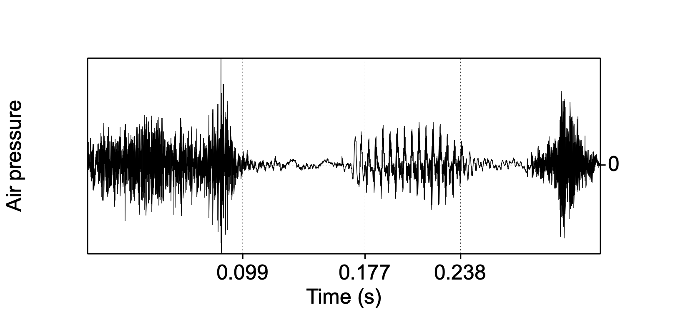

# (PART\*) Part I: Sounds {-}

# Sound waves {#ch-soundwaves}

*Chapter keywords*: sound, sound wave, oscillation, propagation, longitudinal wave, transverse wave, medium, speed of sound, force, pressure, Pascal, oscillogram, frequency, Hertz, period, periodic, aperiodic, fundamental frequency, octave, amplitude, intensity, phase, Pascal, `Praat`, object, visualization, picture, figure, harmonic, overtone, timbre, Fourier, spectrum, spectral envelope, noise, impulse.

## Sound

Sound is a type of energy that travels through a medium (such as air, water, or solid materials) in the form of waves. These sound waves are created by the vibration of objects, which causes the surrounding particles in the medium to move in a back-and-forth (oscillatory) motion. This movement, or vibration, or oscillation, transfers energy through the medium, creating waves of high and low pressure.

## Sound wave {#sec:soundwave}

A sound wave consists of pressure fluctuations caused by the molecules of the acoustic medium crowding together (compression) and moving apart (rarefaction). A sound wave is spread in all directions from the sound source; we could compare its propagation to that of a circular wave on the surface of a water basin. The molecules themselves move over a very short distance and do not travel along with the wave: instead, after the sound wave (the pressure fluctuation) has passed along, they go back to their equilibrium position. 

Sound in air is different from wind. In wind, or in air flow, the air particles move from one position to another (from subtropics to equator, from lungs to mouth, from oceans to continents). In sound, however, there is no net movement of the air particles: the particles only move over a very small distance, and return to their equilibrium after the sound wave has passed. In sound waves, the distance of travel of the air molecules is only about $10^{-11}$ to $10^{-5}$ m, depending on the amplitude and frequency of the vibration (more about these key properties in §\@ref(sec:keypropertiessound) below). 
There are two kinds of waves (also depending on the acoustic medium). In *longitudinal* waves (such as sound waves) the back-and-forth displacement or movement of the medium's particles is in the same direction as the propagation of the wave. In *transverse* waves (such as the waves on the surface of a pond) the back-and-forth displacement of the water particles is perpendicular to the direction of propagation of the wave.  
A stadium wave provides a clear example of a transverse wave: a group of persons (the particles) starts the wave by standing up, rising their arms, sitting down, standing up again, and so on. The persons' action is directly followed by that of their neighbours on one side, who do the same and who are again followed by their next neighbours on their side, and so on, until the wave is travelling through the whole stadium. The persons' motion (up-down) is perpendicular to the propagation of the wave (left-right along the bench). 

Sound propagates in all dimensions through an acoustic medium, like an expanding sphere, which is indeed the theoretical model used to describe the sound wave propagation pattern. As the sound wave moves away from its source, more particles are involved in the pressure fluctuations. As a consequence, sound waves lose energy while travelling through the medium, as some of the energy is spent in moving increasingly more particles. Finally, sound is perceived as such when the sound wave spread by the sound source and travelling through the acoustic medium finally impinges upon the eardrum of the observer. 

## Acoustic media

Air is only one of the media through which sound can propagate. If your head is under water (as in a bath, pool, lake or sea), the water may carry sound waves from the sound source to your eardrums, and you do hear sounds. The propagation of sound waves is faster through liquids than through gases such as air: the closer the molecules of the medium (i.e. the higher its density), the higher the speed of sound in that medium. 

You can also put your ear to the ground in order to hear sounds propagated through the soil. The propagation of sound waves in solid soil is even faster than in liquids. Trying this out on dry sand on the beach, one observer noted hearing footsteps until about 25 m distant [@Minnaert_1970v2, §10].

## The speed of sound {#sec:speedofsound}

In air, the speed of sound (the speed of propagation of a sound wave, symbol $c$) is about 332 m/s at 0°C, about 343 m/s at 20°C, and 353 m/s at at 37°C [@Shadle_2010] (all for dry air at sea level). 
The speed of sound in a gas such as air is affected by only two parameters: 
- the ambient temperature of the gas (as shown in the numbers above), 
- the composition of the gas (its mixture and the density and  compressibility of its component gases), including its relative humidity: humid air holds more particles (of water), resulting in a slight increase of the speed of sound as relative humidity increases [@Harris_1971]^[For relative humidity >30% [@Harris_1971].]. 

In sea water, sound travels at about 1435 m/s, in concrete 3400 m/s, in iron (e.g. railroad tracks) about 5100 m/s. 

## Pressure {#sec:pressure}

Pressure is the amount of force on a surface. In physics, *force* is defined as an influence causing an object to accelerate. It is expressed in Newton units; a Newton is the amount of force that increases the velocity of a 1-kilogram object by one meter per second ($m/s$). *Pressure*, in turn, is defined as force per unit of area. It is measured in Pascal units, which correspond to Newton (N) per square meter ($1\ Pa = 1\ N/m^2$). 
Under normal conditions, atmospheric air pressure is centered at 1013.25 hPa (101325 Pa, an average value^[This is the standard unit of 1 atmosphere. The pressure is due to the Earth's gravition force on the Earth's atmosphere.] on a medium latitude at sea level, at 0°C), with normal meteorological fluctuations of about ± 5000 Pa. Sound wave fluctuations in air pressure are far smaller, ranging from about ±20 µPa (micropascal, or ±0.00002 Pa) at the lower threshold of hearing to about ±20 Pascal at the upper threshold of hearing. Even louder sounds, with variations in air pressure exceeding about ±20 Pascal, are painful and cause hearing damage.

::: {#questions-soundwaves .questionbox}

## Questions {-}

### Question 1.1 {-}

Explain why a sound wave loses energy the further it is spread from the oscillation source.

<details>
  <summary>Answer 1.1</summary>
  <p>The more a sound *wave* moves away from the source, the more particles of the medium (e.g. air)  are involved. The amount of initial energy (spread with the source oscillation) is spread over a larger surface, of an expanding imaginary sphere, and consequently the sound wave displaces more particles. The overall amount of energy remains the same. Therefore, the energy on a single medium particle or on a single portion of the sound wave is smaller. Thus, the sound wave fades as the distance to the sound source increases.</p>
  <p>Remember that the sound *wave* travels through the medium, but the particles in the medium remain more or less in place.</p>
</details>

:::

## Oscillogram {#sec:oscillogram}

As explained in §\@ref(sec:soundwave) above, a sound wave consists of pressure fluctuations caused by the molecules of the acoustic medium crowding together (compression) and moving apart (rarefaction). These oscillations in air pressure can be measured and visualized, in the form of a so-called **oscillogram** or graphical representation of a sound wave.  
(In chapter \@ref(ch-soundtobytes) we'll learn how to measure, record and store a sound wave. Here, we jump ahead and present the oscillogram, in order to explain important properties of sound waves.)

In an oscillogram, the horizontal axis represents the time dimension, and the vertical axis represents the air pressure. The air pressure fluctuations (compression and rarefaction) are displayed here as vertical deviations relative to the horizontal baseline^[The baseline represents the ambient average air pressure. By convention, higher air pressure is on the top side and lower air pressure at the bottom side of an oscillogram.]. 
Thus an oscillogram records the back-and-forth movements of the air particles, indirectly, by recording the fluctuations in relative air pressure, at a fixed location. 

```{r speech-oscillogram, echo=FALSE, fig.cap="Oscillogram of the word *speech*, with boundaries between segments.", fig.align="center"}

```

An oscillogram is comparable to a meteorologist's regular measurements of atmospheric air pressure at a fixed location --- albeit on far finer scales of time and of air pressure. 

The visualisation in an oscillogram may suggest, misleadingly, that the air particles themselves dance "up and down" (transverse) while the sound wave travels "from left to right", like waves on the surface of a body of water. That is not true: sound in air travels in *longitudinal* sound waves, resulting in the air pressure variations that are visualized in the oscillogram.    

## Periodic and aperiodic sounds {#sec:periodicity}

There are two classes of sounds which are easily distinguishable in an oscillogram: 

- **periodic** sounds, in which there is sound wave pattern that repeats itself after a particular time interval or **period** (symbol $T$) of a single cycle. Periodic sounds have a perceptible pitch or tone. Vowel sounds such as the /i/ in Figure \@ref(fig:speech-oscillogram) (from 0.177 to 0.238 s) provide clear examples of a periodic sound. 

- **aperiodic** sounds, in which there is not a repetitive but instead a random pattern in the air pressure variations. Aperiodic sounds do not have a perceptible pitch but instead we hear them as noise. Some consonant sounds, e.g. the /s/ in Figure \@ref(fig:speech-oscillogram) (from 0 to 0.099 s), are clear examples of such noisy, aperiodic sounds^[The clearest examples are provided by unvoiced fricative consonants, such as /f, s/.]. 

<!-- insert fig2c.eps -->
## Key properties of a sound wave {#sec:keypropertiessound}

A periodic sound wave can be characterized by three key properties, which are illustrated in the oscillogram in Figure \@ref(fig:example-oscillogram) and which are further discussed in the following sub-sections.  

```{r example-oscillogram, echo=FALSE, fig.cap="Oscillogram of a periodic sound (in black), with indications of the key properties frequency (1/period, see below), amplitude, and phase. The oscillogram is recorded over time (along the horizontal axis), at a fixed position in space.", fig.align="center"}
xx <- seq(-0.1,0.1,by=.0001) # .1 ms
yy <- 0.5*sin(2*pi*200*xx-.6) # + 0.3*sin(2*pi*400*xx-.6) # + 0.4*sin(2*pi*600*xx+.1)
T <- .005 # period
# f0 is 200 Hz, each period is 5 ms or 50 samples
plot( xx, yy, type="l", xlim=c(-0.0025,.010),
      ylim=c(-0.8,0.8), lwd=2, 
      xlab="Time (s)", ylab="Relative pressure")
abline(h=0, lty=2)
abline(v=0, lty=2)
abline(v=0.000475, lty=2)
arrows( x0=0.00425, y0=min(yy), y1=max(yy), 
        lwd=3, angle=15, col="darkred", code=3 )
text( x=0.00425-0.0002, y=0.25, pos=2, cex=1.25, adj=0.8,
      labels="Amplitude", col="darkred", srt=90 )
# arrows( x0=0.0054, y0=-0, x1=.0054+T-0.0001,
arrows( x0=0.0+T+0.000475, y0=-0, x1=0+T+T+0.000475-0.0001,
        lwd=3, angle=15, col="darkred", code=3 )
# half a period, centered, nudge left
text( x=0+T+T/2+0.000475-0.0001, y=0, pos=1, labels="Period", cex=1.25, 
      col="darkred", adj=0.5 )
arrows( x0=0, y0=0.7, x1=.000475,
        lwd=3, angle=15, col="darkred", code=3, length=0.1 )
text( x=0, y=0.7, pos=2, cex=1.25, labels="Phase",
      col="darkred", adj=1 )
```

### Frequency {#sec:frequency}

The frequency (symbol $f$) of a sound wave is the number of repeated cycles or periods (of air pressure variations) within a time interval. Only periodic sounds do have such repetitions, and thus a frequency. The frequency of a sound is perceived as its *pitch* or tone. Frequency is expressed in periods per second, or Hertz units, named after Heinrich Rudolf Hertz (1857-–1894)^[In older texts you may find 'cycles per second', abbreviated 'cps'.]. 
Each of these periods or cycles corresponds to the repeating fluctuation between two consecutive maxima, or between corresponding 'zero crossings' of adjacent periods. In Figure \@ref(fig:speech-oscillogram), in the vowel /i/, we count 14 periods in 0.065 seconds, so $f \approx 14/0.065 \approx 215$ Hz. These periods have a duration of about $T \approx 0.065/14 \approx 0.0046$ s^[More exactly, the period *is* 0.0046 s.]. Period $T$ and frequency $f$ are each other's inverse, so $f=1/T$ and $T=1/f$. 

In the transverse stadium wave, the period $T$ is the time interval between two consecutive actions of standing up by the same person (e.g. $T=5$ s), and frequency $f$ is the number of actions that occur within a given time unit (e.g. $f=1/T=1/5$ Hz). 

#### Octave {#sec:octave}

An octave refers to a frequency ratio of $1:2$ or $2:1$, that is, doubling or halving of the frequency. An octave is the distance between 12 semitones (guitar frets or piano keys, counting black and white keys). If you sing or play a musical note (e.g. note `A2` with $f=110$ Hz), and then jump to the next higher octave, then the new note `A3` has a frequency of $2 \times 110=220$ Hz. The next higher octave note `A4` has a frequency of $2 \times 220=440$ Hz.  
(As an aside: doubling the frequency means halving the wavelength, and vice versa, see §\@ref(sec:wavelength) below).

### Amplitude {#sec:amplitude}

The amplitude (symbol $A$) of a sound wave is the extent of the variations in air pressure (due to compression and rarefaction), measured in Pascal units of pressure. With some simplification, the amplitude of a sound wave is perceived as its *loudness* or 'volume'. In an oscillogram, the amplitude corresponds directly to the maximum vertical displacement, that is, to the peak deviation in air pressure relative to the ambient reference pressure). 

In the transverse stadium wave, the amplitude could be thought of as the extent to which persons raise their hands: the heighth of the wave crests.

In practice, the amount of energy in a (longitudinal) sound wave is better assessed in the form of *intensity*, which is discussed in §\@ref(sec:intensity) below.  

**Study tip**: The sections on amplitude and on intensity (including decibels) are rather difficult. In first pass, just read these sections globally. After having finished the entire chapter (or more), return for a deeper second pass through these sections. Compare the explanations in these sections with those in your textbook, and then return for a third pass through these sections. 

#### RMS amplitude

How can we calculate the mean or average amplitude of a sound wave, over a particular stretch of time? We do this by squaring the amplitude values, then averaging the squared values, and then taking the Root of the Mean of the Squares. The resulting value is termed the **RMS** amplitude, and it is equivalent to the *standard deviation* of the amplitude, computed over a particular stretch of time. 

In a simple sinewave tone, as in Figure \@ref(fig:example-oscillogram), the RMS of the amplitude corresponds to $0.707 \times$ the maximum or peak amplitude.

### Energy, power, intensity {#sec:intensity}

Amplitude is related to the pressure variations of a sound wave (with pressure defined as force per unit area; §\@ref(sec:pressure)). The *energy* of the sound wave is its capacity to do work, that is, to exert a force on (and thus causing displacement of) particles of the medium, that is, to propagate. Thus we want to consider the amount of acoustic energy, imparted by the vibrating sound source, and transmitted throughout the medium by causing particles to bump into each another. Energy is expressed in Joule (J) units; one Joule "is equal to the amount of work done when a force of one newton displaces a mass through a distance of one metre in the direction of that force" (< https://en.wikipedia.org/wiki/Joule>). 

We saw earlier that we may regard the sound propagating through the medium as an imaginary expanding sphere (see §\@ref(sec:soundwave)). Consider the sound of a single impulse, say a hammer hitting a nail, with air as the medium of propagation. The energy of the sound remains constant, but as the sound propagates, the imaginary sphere expands, and the original energy is distributed over a wider area of that imaginary sphere. The variations in air pressure decrease as the sphere expands, that is, as the distance to the sound source increases. 

Energy is independent from the time dimension: a continuous sound having an energy of 10 J for 1 second involves as much total energy as a continuous sound having an energy of 5 J for 2 seconds. When studying sounds, however, we typically do take time into account: we are interested in the amount of energy of a sound *per second*. This is termed the *power* of the sound. Power is expressed in Watt (W) units; one Watt equals 1 Joule per second. By analogy, you may consider a lamp of 10 W burning for 1 hour, and another lamp of 5 W burning for 2 hours. Both lamps have consumed equal amounts of energy (in principle), but the lamp with higher power converts more energy *per hour* into light: it shines brighter. 

For sound waves, we are interested in the amount of power, but now expressed per unit area on the imaginary sphere of propagation of the sound wave in the medium (see §\@ref(sec:soundwave)). How much acoustic energy is transferred in the wave, by particles colliding with their neigboring particles, per time and per area? This property is termed the **intensity** of the sound. Intensity is expressed in units of energy per square meter perpendicular to the direction of propagation ($\textrm{W}/\textrm{m}^2$). 

The intensity of a sound drops off as the distance to the sound source increases^[The intensity on the surface of the sphere undergoes a dropoff which can be calculated as $I=I_s/4πr^2$, with $I_s$ being the intensity at the source, and $r$ being the radius of the sphere, that is, the distance from the source.]. The sound of a hammer hitting a nail has an intensity $I/1 = I$ at a distance of $1 \cdot r$, but only an intensity of $I /3^2 = I/9$ at a triple distance of $3 \cdot r$. If you double the distance from $r$ to $2r$, the intensity is significantly reduced by $-14$ dB (§\@ref(sec:decibel)). **Protect your ears** against loud sounds by moving away from the sound source!

The intensity of a sound is proportional to the maximum pressure variations of that sound, with
$$I = \frac{1}{2} \cdot \frac{p^2}{\rho \cdot c}$$ 
where $p$ is the RMS amplitude of pressure variations, $\rho$ is density of the medium (for air, $\rho = 1.29\ \textrm{kg}/\textrm{m}^3$) and $c$ is speed of sound (in air, $c = 332\ \textrm{m}/\textrm{s}$ at 0°C, see §\@ref(sec:speedofsound)). A simple sine wave (as in Fig. \@ref(fig:example-oscillogram)) with frequency $f=1000$ Hz and with RMS amplitude of pressure of $p=2 \cdot 10^{-5}\ \textrm{N}/\textrm{m}^2$ has an intensity $I = 4.7 \cdot 10^{-13}\ \textrm{W}/\textrm{m}^2$.
Because $1/2$ and $\rho$ and $c$ are approximately constant, the relationship between intensity $I$ and air pressure $p$ is often simplified as $I \propto p^2$.  

Experiments have shown that the sensitivity of the human ear corresponds approximately with the *logarithm* of the intensity (at the eardrum). This makes it attractive to use logarithmic scales for sound pressure and for the intensity of a sound. Such a scale allows us to represent very large and very small values with equal perceptual accuracy across the scale. 

#### Logarithm {#sec:logarithm}

The *logarithm* of a number $x$, or $\log(x)$, is the exponent or power to which you must raise a given base number in order to obtain $x$. For the base number, we often use $10$ or $2$. So-called 'natural logarithms' have $e \approx 2.7$ as the base number, and these are often indicated as $\ln(x)$. For example, 
$$^{10}\log(1000)=3$$
since $$10^3=1000$$

One advantage of using logarithms is that multiplication of two numbers is simplified to addition of their logarithms (using a common base):
$$100 \cdot 1000 = 100000$$
$$10^2 \cdot 10^3 = 10^{2+3} = 10^5$$
$$^{10}\log(100) + ^{10}\log(1000) =2+3= ^{10}\log(100000) =5$$

Another advantage is that large *ratios* (e.g. of sound intensities or frequencies) are easier to express as logarithms:
$$10 : 1000 = 10^1 : 10^3$$
$$^{10}\log(10) : ^{10}\log(1000) = 1 : 3$$

::: {#log1 .warningbox}
By definition, $x^0=1$, and $^x\log(1)=0$, for any base $x$. 
::: 

Intensity is perceived in an approximately logarithmic fashion: each tenfold increase of intensity (logarithm using base $10$) is perceived as one equal step in intensity, as further explained below. In a similar fashion, frequency too is perceived in logarithmic fashion: each twofold increase of frequency (doubling, logarithm using base $2$) is perceived as one equal step in frequency, viz. by one octave (§\@ref(sec:octave)). 

#### Decibel {#sec:decibel}

Sound intensity or sound pressure is not expressed in absolute units, but in relative decibel units. The *decibel* unit of intensity (or of sound pressure) is based on three steps [@Fry_1979, p.91ff]: 

1. Take the **ratio** of the intensities (pressures) of a target sound, and the intensity (or pressure) of some reference sound -- more about that reference sound in the next paragraphs; 

2. Take the **logarithm** (§\@ref(sec:logarithm)) of that intensity ratio (pressure ratio); this results in a log ratio, in *Bel* units, named after Alexander Graham Bell (1847-1922, inventor of the telephone). 

3. **Multiply** the logarithm **by 10** to obtain the intensity ratio in *decibel* units. 

Several different references are commonly used:

- a reference sound that has a standard RMS pressure of $p_0 = 2 \cdot 10^{-5}\ \textrm{Pa}$, and/or a standard intensity of $I_0 = 10^{-12}\ \textrm{W}/\textrm{m}^2$. This is the weakest sound perceived by humans^[This reference is the *minimal* hearing threshold, achieved only by the 1% most sensitive listeners. The *average* hearing threshold, achieved by 50% of listeners, is at about +16 dB relative to this reference value [@Fletcher_1953, Fig.96], see below.]. 
As this reference $p_0$ is expressed in RMS units of sound pressure (in Pascal units), ratios using this $p_0$ as absolute reference are termed `dB Sound Pressure Level` or `dB(SPL)`, as in Table \@ref(tab:decibels) below.\
(Aside: In the reference sound, the air particles move back and forth over a tiny distance, roughly the same as the size of the molecules in air! If our hearing would be just slightly more sensitive, we would just hear the constant (brown) noise of the Brownian movement of the particles in the atmosphere (see §\@ref(sec:noise)).)

- the smallest sound pressure perceived by a particular *individual* listener (test participant, patient) at a particular frequency in a particular ear, this is called the 'sensation level' (of that ear, listener, frequency). Comparisons using this relative threshold are termed `dB (SL)`; this allows us to present auditory stimuli with an equal subjective loudness across listeners and across ears. 

- the *loudest* sound (highest pressure, or voltage, or intensity) that a device can process without distorting the input signal; incoming sounds are expressed in negative dB units below this reference.

Putting the three steps together, we see that for sound intensity levels:
$$L_I = 10 \cdot ^{10}\log \left( \frac{I}{I_0} \right)$$
where $L_I$ is the level of intensity, in dB, $I$ is the intensity of the target sound, and $I_0$ is the intensity of the reference sound (see above), e.g. $I_0 = 10^{-12}\ \textrm{W}/\textrm{m}^2$. \
The three steps may be followed by working through this formula from the inside out: (1) we take the target-to-reference ratio, (2) we take the logarithm of that ratio (using 10 as base number), and (3) we multiply by 10 to obtain *deci*bel units.  

If the target sound has an intensity $I$ which is $10000\times$ as large as $I_0$, then 

$$L_I = 10 \cdot ^{10}\log \left( \frac{I}{I_0} \right) = 
10 \cdot ^{10}\log \left( 10000 \right) = 
10 \cdot 4 = 40\ \textrm{dB}$$


For sound pressure levels, using RMS amplitude of sound pressure:
$$	L_p = 10 \cdot ^{10}\log \left( \frac{I}{I_0} \right) 
		= 10 \cdot  ^{10}\log \left( \frac{p}{p_0} \right)^2 
		= 20 \cdot  ^{10}\log \left( \frac{p}{p_0} \right) $$
where $L_p$ is the level of sound pressure, in dB, $p$ is the RMS amplitude of the target sound, and $p_0$ is the RMS amplitude of the reference sound (see above), $p_0 = 2 \cdot 10^{-5}\ \textrm{Pa}$. 

A doubling of the sound pressure, that is, of the RMS amplitude (factor 2, ratio 2) means an increase of the sound pressure level by +6 dB:
$$20\cdot ^{10}\log \left( \frac{2}{1} \right) = 20 \cdot ^{10}\log (2) =	20 (0.30103) = 6.0206 \approx 6$$

A doubling of the intensity means an increase of the sound intensity by +3 dB:
$$10\cdot ^{10}\log \left( \frac{2}{1} \right) = 10 \cdot ^{10}\log (2) =	10 (0.30103) = 3.0103 \approx 3$$

By definition, a value of 0 dB means that the target sound has the same sound pressure and/or same intensity as that of the chosen reference sound.

::: {#questions-0dB .questionbox}

#### Question 1.2 {-}

Check that the last sentence above holds true. 

::: 

Table \@ref(tab:decibels) shows some examples of sound intensities under various circumstances [@Fry_1979, p.94].

Table: (#tab:decibels) Examples of sound intensities in dB (SPL), in various situations. 

| dB (SPL) | situation | 
| -------- | :-------- |
|     192  | Loudest sound possible in air, rarefactions are vacuum (<https://en.wikipedia.org/wiki/Sound_pressure#Examples_of_sound_pressure>) |
|     172  | Krakatoa eruption, 1893 (at 165 km distance)  (<https://www.popsci.com/story/science/loudest-sounds-ever-measured/>) |
|     130  | Jet engine (at 30 m distance) | 
|     120  | Threshold of pain |
|     103  | Recommended maximum level in clubs and venues in the Netherlands (average over 15 min, peaks may be higher) | 
|     100  | Symphony orchestra playing 'fortissimo' |
|      92  | Outside on emergency lane of busy highway (200 cars/min, 60 mph) [@Dahl_Miller_Cato_Andrew_2007] | 
|      85  | Hearing protection is obligatory for employees in the Netherlands |  
|      80  | Shouting, singing (at 1.5 m distance); street noise |
|      65  | Pedestrian city area |
|      60  | Average conversation (at 1.5 m distance) |
|      40  | Quiet room | 
|   35-40  | Outside in residential area, at night |
|      30  | Whispering | 
|      27  | Outside in Hermit Basin, at the bottom of the Grand Canyon, USA [@Dahl_Miller_Cato_Andrew_2007] |
|      20  | Background inside audio studio | 
|      16  | Average threshold of hearing for 50% of listeners [@Fletcher_1953, Ch.8] |
|       0  | Reference value; absolute threshold of sine wave sound with $f=1000$ Hz |


### Phase {#sec:phase}

The phase of a sound wave (symbol $\varphi$) is the starting time of a sound wave period, relative to the duration of that period. It's easiest to explain by comparing two sounds. When listening, a single sound will arrive at our two ears at slightly different arrival times. (Unless the sound source is directly behind or in front, the sound will have a slightly longer path to travel to the further ear than to the nearer ear.) Thus the two sounds heard by the two ears will differ in phase: the starting time of a period in one ear will differ slightly from the starting time of a period in the other ear, and the difference can be expressed as the proportion of a period by which they differ.  
The brain of the listener uses this phase difference between the two ears to estimate the direction of the sound source relative to the head. You may appreciate the effect by listening to a music record in mono or in stereo. 

In addition, we use phase unconsciously to assess atmospheric and acoustic conditions. For example, when listening to a sound in a room, we hear not only the direct sound but also the indirect reflections from the floor, walls, ceiling, furniture, people, etc. The brain uses the phase relations among multiple reflections to assess the dimensions and conditions of the room. 

Phase is expressed relative to the period $T$, but it is not expressed in time (seconds) but in proportions, often expressed as degrees in the period cycle (which runs from $0^\circ$ to $360^\circ$). So, a phase difference of $\varphi=180^\circ$ and $\varphi=0.5$ mean the same: the time difference between the two signals is half a period, whatever the duration of that period is. 

In the transverse stadium wave, phase corresponds to the difference in time between the sit-down-moment of one group of persons, and the comparable sit-down-moment of another group of persons in a different section of the stadium. Imagine two waves rolling along the stadium benches: one wave on the lower benches, and a different wave on the upper benches. The two waves may be out of phase (lower and upper persons sit down at different times) or in phase (lower and upper person sit down at the same time) -- irrespective of whether the two waves have the same or different frequencies. 

::: {#questions-phase .questionbox}

### Question 1.3 {-}

Continue this thought experiment, with two stadium waves having the same frequency on the lower and upper benches, and with phase $\varphi=0.5$ between the lower and upper sections. What would the resulting wave pattern look like? 

::: 

### Wavelength {#sec:wavelength}

The wavelength (symbol $\lambda$) is the length of a single cycle or period, as a distance in the medium in which the sound wave propagates, between repeated patterns in the wave. It is expressed as a distance in meters. The wavelength depends on the propagation speed $c$ of the sound wave in m/s (see §\@ref(sec:speedofsound)), and on its frequency $f$ in Hz (see §\@ref(sec:frequency)).
$$\lambda = c / f$$
$$\lambda = c \, T$$
Sounds with higher frequency have shorter wavelength, and vice versa. A periodic sound with $f=440$ Hz has a wavelength in air of $\lambda \approx 343/440 = 0.7795$ meter. 

```{r example-wavelength, echo=FALSE, fig.cap="Snapshot of the pressure of a sound wave in air, varying with distance from the sound source (along the horizontal axis). The snapshot was taken at a fixed moment in time, with c=343 m/s in the air. ", fig.align="center"}
plot( xx,yy, xlim=c(0,.010), ylim=c(-.8,+0.8), 
      xlab="Distance (m)", 
      ylab="Relative pressure", type="l", lwd=2, xaxt="n" )
abline(h=0, lty=2)
abline(v=0, lty=2)
abline(v=0.00035+c(0,1)*T, lty=2)
arrows( x0=0.00035, y0=.7, x1=0.00035+T,
        lwd=3, angle=15, col="darkred", code=3 )
# half a period, centered, nudge left
text( x=.00035+T/2, y=0.7, pos=1, labels="Wavelength", cex=1.25, 
      col="darkred", adj=0.4 )
axis( at=0.00035+(0:2)*T, labels=(0:2)*343/200, side=1 )
```

> TODO adjust wavelenght plot

In the transverse stadium wave, the wavelength $\lambda$ is the distance in meters (on the same bench) between two persons in two consecutive periods who reach the highest point of their sit-stand-arms-up cycle. This is the distance the wave has traveled between the two moments at which a person repeats the same action. If we assume that $c=10$ m/s and $f=0.2$ Hz (as very rough estimates), we find that the wavelength $\lambda=c/f=10/0.2=50$ meter. 

-----

::: {#box-praatintro .praatbox}

## How to work with `Praat` {#sec:praatintro}

`Praat` is a computer program designed to process, analyze and visualize speech sounds. 

After starting the program, `Praat` opens two windows: an *Objects* window (typically on the left) and a *Picture* window (typically on the right). 

### Objects {-}

In `Praat`, signals and derived representations are all seen as objects. Objects may have different types, e.g. Sound, Spectrum, Pitch, etc^[By convention, object types are written with a capital; this helps to distinguish physical properties (e.g. the intensity of a sound) from the `Praat` representations of those properties (e.g. the Intensity object computed from a Sound object, both within `Praat`).].  
Each type of object comes with pre-defined operations that are possible. If you select an object of a different type, then the buttons (operations) change with the object type. 
As an analogy, consider the various types of objects in your room: clothing items and human bodies may be washed, food may be cooked but human bodies may not be cooked, furniture and food items may be opened but human bodies may not be opened, clothing can be inside furniture, etc. Moreover, relations between object types are also specified: for example, a plant can become a food item (by means of cooking), but a human body may not. 

Before working with an object, you need to select that object, by clicking on it in the list of objects displayed in the Praat Objects window. 

Objects of any type may be saved and opened using the `Save` and `Open` options in the top menu of the Objects window. This is a great way to save the objects resulting from your phonetic analyses, i.e., to save your results.  

The buttons at the bottom of the Objects window are *always* available for objects of any type: `Rename...`, `Copy...`, `Inspect` (to take a deeper look), `Info`, and `Remove`.

We will often work with objects of the *Sound* type. Such a Sound object is a digital sound (sampled audio), which you can Play or Scale or Convert or Combine, etc. You may analyze a Sound, which will typically result in an object of a different type (e.g. Pitch). Sound objects can be opened from disk, and they can be saved as audio files in a wide variety of audio formats.  

### Picture window {-}

`Praat` will draw its visualisations (figures) in its Praat Picture window. The figure will be scaled to the area with the pink boundary, the so-called viewport. By changing the viewport after drawing a part of a figure, you may obtain multiple visualizations in a single figure, as will be illustrated in this tutorial. 

The combined figure in the viewport may be saved (`File > Save`) or printed (`File > Print`) in the top menu of the Praat Picture window. 
You may also save the figure in a different way, as a "recipe" set of instructions to re-create the figure (`File > Save as Praat picture file`), for later reuse.  

:::
<P>

::: {#box-open .praatbox}

## How to draw an oscillogram 

### Open an audio file

- In the `Praat` Objects window, go to the top menu, choose `Open`, then `Read from file...` and pick the desired audio file. It will be loaded as a Sound object at the bottom of the list of objects in the `Praat` Objects window. 

For the time being, selecting a short audio will make it easier for you to explore how `Praat` works; choose an audio file containing only a few seconds of sound. 

- **The last-added object in the list is selected automatically.** 

- In the `Praat` objects window, go to the bottom menu, choose `Info`. If it does not exist, `Praat` will open an additional window, titled `Praat Info`. In this window you'll see all kinds of meta-data (data about data) of the selected Sound object, with numbers in scientific notation (see below).  

:::

<P>

::: {#scientificnotation .warningbox}

#### Scientific notation {#sec:scientificnotation}

The scientific notation of a number such as `9.876e-2` is to be read as $9.876 \times 10^{-2} = 9.876 \times 0.01 = 0.09876$; for background see <https://en.wikipedia.org/wiki/Scientific_notation>.

:::

<P>

::: {#box-draw .praatbox}

### Draw an oscillogram

- In the `Praat` Objects window, select a Sound object.

- Next, in the `Praat` Object window, choose `Draw > Draw...` and use default values for all arguments or options (button `Standards`).   

- After pressing `OK`, the dialogue menu disappears, and the oscillogram of the Sound is drawn in the selected viewport area in the Picture window, with some basic labeling of axes (if option `Garnish` is on). 

- If you are not happy with the resulting figure: in the `Praat` Picture window, choose `Edit > Erase all`, or `Edit > Undo`, and start again at the top of this subsection. 

### Save a picture

- Check the page setup: in the `Praat` Picture window, choose `File > Page setup...`, and check the settings. 

- You can save the selected Viewport area in several formats: \ 
`PDF` is best for publication-quality figures. \ 
`PNG` format is best for on-screen images (blogs, web pages, documentation). A graphical resolution of 300 pixels per inch-on-screen (dots per inch, or dpi) if often adequate, since that graphical resolution is typically better than most computer screens (but you can try out 600 dpi for your setup). \ 
`EPS` format is nowadays less popular, but may offer flexibility for downstream image processing (check documentation about this format).  

- Store the graphical (image) file in an appropriate folder for your project on your computer, under an appropriate file name, that will still make sense to you in a year's time. Make a note in your journal about where you've saved this file, and about the contents of the file.

:::
