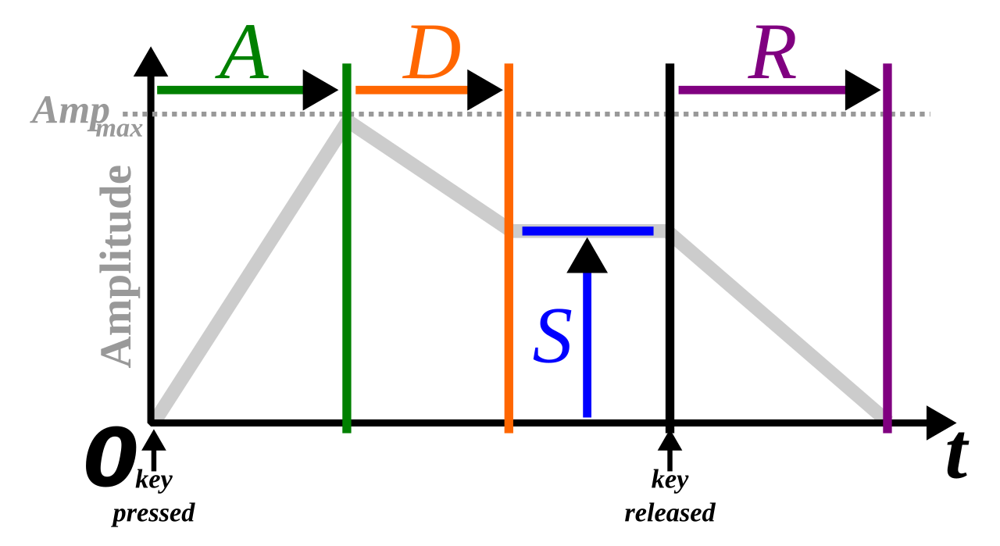

# Complex sounds and spectra

*Chapter keywords*: sinewave sound, complex sound, spectrum, fourier transform, fourier analysis, fast fourier transform, FFT, harmonics, fundamental, fundamental frequency, f0, overtone, component, timbre, octave, noise, white noise, brown noise, impulse. 

## Introduction 

The *sine wave*, depicted in Fig. \@ref(fig:example-oscillogram), is the simplest sound possible. It is composed of the simplest back-and-forth variation or oscillation in air pressure, similar to the regular swing pattern or oscillation of a pendulum^[Drawing the position of a swinging pendulum over time will result in the same figure.]. We only encounter sine wave sounds if they are artificially generated, and hardly ever in nature -- although the sound of a tuning fork comes quite close to a sinewave pattern. 

By contrast, *complex sounds* have more complex wave patterns. All natural periodic sounds are complex sounds. **A complex sound can be regarded as the sum of multiple sine wave sounds.** This relation has been described by the French mathematician, baron J.B.J. Fourier (1768--1830). The sine waves are termed 'frequency components' of the complex sound. Each of these components has its own frequency, amplitude, and phase. In a so-called 'Fourier analysis' or 'Fourier Transform' of a complex sound, these frequency components are being estimated from the waveform^[There is also a faster version of the Fourier transform, called 'Fast Fourier Transform' or FFT, which requires significantly fewer computations; FFT requires that the number of samples to be analysed is a power of $2$.].

If the complex sound has a repeating waveform, then we have a periodic complex sound, of which Figure \@ref(fig:fourier-oscillogram) provides an example. The resulting sound has been obtained by adding three frequency components, drawn in dotted lines, of 100 Hz ($T=.01$) and 200 Hz ($T=.005$) and 400 Hz ($T=.0025$), respectively. Note that the frequency with which the complex sound repeats itself, 100 Hz, is the same as that of the lowest component. This lowest component is called the *fundamental*, and its frequency is called the *fundamental frequency* (symbol $f_0$) of the complex periodic sound; we hear this $f_0$ as its pitch. The higher components are called *overtones*. The fundamental and overtones are collectively called *harmonics*: the fundamental is the first harmonic, the first overtone is the second harmonic, etc. 
**In a periodic complex sound, the frequencies of the overtones are integer multiples of the fundamental.**  

> TODO crossref pitch, missing fundamental

Typical examples of periodic complex sounds are the vowel sounds in normal speech. The properties of a periodic complex sound depend on the amplitudes, frequencies and phases of its component harmonics. 

```{r fourier-oscillogram, echo=FALSE, fig.cap="Oscillograms of three sinewave sounds and their resulting complex periodic sound.", fig.align="center"}
xx <- seq(-0.1,0.1,by=.0001) # .1 ms
yy <- 0.5*sin(2*pi*100*xx) + 0.4*sin(2*pi*200*xx) + 0.2*sin(2*pi*400*xx)
T <- .01 # period
# f0 is 100 Hz, each period is 10 ms or 100 samples
plot( xx, yy, xlim=c(-0.0025,.020),
      ylim=c(-0.85,0.85), lwd=2, 
      xlab="Time (s)", ylab="Relative pressure", type="n")
lines( xx, 0.5*sin(2*pi*100*xx), lty="dotted", col="grey50" )
lines( xx, 0.4*sin(2*pi*200*xx), lty="dotted", col="grey60" )
lines( xx, 0.2*sin(2*pi*400*xx), lty="dotted", col="grey70" )
lines( xx, yy, lty=1, lwd=2 )
abline(h=0, lty=2)
abline(v=0, lty=2)
# abline(v=0.000475, lty=2)
# arrows( x0=0.00425, y0=min(yy), y1=max(yy), 
#         lwd=3, angle=15, col="darkred", code=3 )
# text( x=0.00425-0.0002, y=0.25, pos=2, cex=1.25, adj=0.8,
#       labels="Amplitude", col="darkred", srt=90 )
# # arrows( x0=0.0054, y0=-0, x1=.0054+T-0.0001,
# arrows( x0=0.0+T+0.000475, y0=-0, x1=0+T+T+0.000475-0.0001,
#         lwd=3, angle=15, col="darkred", code=3 )
# # half a period, centered, nudge left
# text( x=0+T+T/2+0.000475-0.0001, y=0, pos=1, labels="Period", cex=1.25, 
#       col="darkred", adj=0.5 )
# arrows( x0=0, y0=0.7, x1=.000475,
#         lwd=3, angle=15, col="darkred", code=3, length=0.1 )
# text( x=0, y=0.7, pos=2, cex=1.25, labels="Phase",
#       col="darkred", adj=1 )
```

### Timbre
 
Two periodic complex sounds, having the same overall amplitude and fundamental frequency, may differ strongly in their character. 
The general name for this property is *timbre*. 
Timbre depends on the relative amplitudes of the harmonics, and hence very many different timbres are possible. 
For aperiodic sounds, timbre also depends on the relative amplitudes of the (infinitely many) frequency components.
A sound may have a dull or sharp timbre, or rich or thin, warm or metallic. The difference between distinct vowels, such as /a/ vs. /i/, spoken by the same person at the same pitch and amplitude, is also a matter of timbre, as is the difference between similar but distinct consonant sounds, such as /s/ vs. /ʃ/.

Timbre is not a one-dimensional property of a sound (as frequency and amplitude are), but a multi-dimensional property. 

## Spectrum

An unchanging sound can be represented in two equivalent ways: as a function of time (in an oscillogram), or as a function of frequency. The latter representation is called a *spectrum*. 

Figure \@ref(fig:complex100n200n400) shows an oscillogram on the left (of the same complex sound as shown in Fig. \@ref(fig:fourier-oscillogram), and its matching spectrum on the right. The spectrum shows the amplitude (along the vertical axis) of each frequency component (along horizontal axis)^[Here, the phase of the frequency components is ignored.]. Hence, a spectrum shows the frequency and amplitude of each component. 

```{r complex100n200n400, echo=FALSE, fig.cap="Oscillogram (left) and spectrum (right) of a complex periodic sound.", fig.align="center"}
knitr::include_graphics("figures/complex100n200n400.png")
```

::: {#questions-spectrum .questionbox}

### Questions {-}

#### Question 3.1 {-}

Draw the spectrum of a sinewave sound with a frequency of 450 Hz and an amplitude of 40 dB SPL. 

:::


> TODO Praat instruction box

## Spectra of aperiodic sounds

Stable noise and brief impulses are two types of aperiodic signals (§\@ref(sec:periodicity)): the variations in air pressure do not follow a regular periodic pattern^[Or, you might say that the period is infinitely long.]. Aperiodic sounds do not have a fundamental frequency (because there is no regular period), and their phase is undefined, but aperiodic sounds do have an amplitude and a spectral composition. 

### Noise {#sec:noise}

First we discuss *stable* aperiodic sounds: **noise**. You might say that a noisy sound has an infinite number of frequency components. That is, the components are not only harmonics of the fundamental frequency (as with periodic complex sounds), but may be found at *every* frequency. The relative amplitudes of the many frequency components determines the timbre of the noise. 

In *white noise*, all frequency components are equally strong^[This is called 'white' noise by analogy with white light, in which all frequency components in the visible part of the electromagnetic spectrum are equally strong.], and thus the spectral envelope is flat. 
In so-called *brown noise*, the spectral envelope decreases by $-6$ dB per octave, so that lower frequencies are more dominant than higher frequencies. Because this spectral envelope resembles that of speech, brown noise is often used in phonetic research whenever we need to mask speech.

```{r spectrum-whitebrownnoises, echo=FALSE, fig.cap="Spectra of white noise (left) and of brown noise (right), with a linear frequency axis (in kHz).", fig.align="center"}
knitr::include_graphics("figures/whitebrownnoises.png")
```

The random deviations from the ideal, smooth spectral envelope are due to (a) the random variability inherent in noise, and (b) the fact that the spectrum was calculated over a finite amount of time^[If you would listen to white noise for an infinitely long time, then all frequency components would indeed be equally strong.], with (c) a particular sampling frequency of the noise. 

### Impulses {#sec:impulses}

An **impulse** is a very brief and *transient* sound, such as a hand clap or tick. Acoustically, a very brief impulse sound is like a brief burst of white noise, with a flat spectral envelope. The shorter the impulse, the flatter the spectral envelope becomes. 

An impulse may occur unintentionally if the amplitude suddenly increases from zero to a high value, e.g. at the onset of a sound recording starting at a nonzero value. The resulting noise burst should be effectively removed by *fading in* the sound, see §\@ref(sec:fades) for more. 

## Envelope

The *envelope* of a sound describes how the properties of that sound change over time. This concept is best described by regarding the amplitude of a sound: the 'amplitude envelope'. However, a sound may at the same time have multiple and different envelopes for its amplitude, for its (fundamental) frequency, and for (a singular parameter of) its timbre. Even the properties of a filter may follow an envelope, that is, they may change over time (see Ch. \@ref(ch-filtering)).

The concept of the *envelope* of a sound property stems from electronic music (synthesizers); critical time points are the onset and offset of a key being pressed on the keyboard of the synthesizer. However, the envelope is also a helpful concept for describing analog musical sounds (e.g. picking a guitar string) and speech sounds (e.g. plosive vs fricative consonants).  

```{r envelope, echo=FALSE, fig.cap="A typical amplitude envelope (in gray), with four key parameters Attack, Decay, Sustain, Release describing the changes of amplitude over time, relative to the onset and offset of a synthesizer keyboard key press. Image taken from  $https://commons.wikimedia.org/wiki/File:ADSR_parameter.svg$, used under CC-BY-SA license.", fig.align="center"}

```

> A 
> D 
> S 
> R

<!-- While the concept of the *envelope* of a sound stems from electronic music (synthesizers), it is also helpful in understanding the difference between e.g. fricative consonants (as in 'sheep', with gradual onset, slower attack of amplitude) vs. affricate consonants (as in 'cheap', with abrupt onset, fast attack of amplitude). This contrast may be manipulated convincingly by only varying the attack time of the (isolated) word. -->

In terms of its amplitude, we may regard a brief impulse sound (click or pulse, see §\@ref(sec:impulses) above) as having very short attack and decay times, a zero sustain level, and zero release time.  
