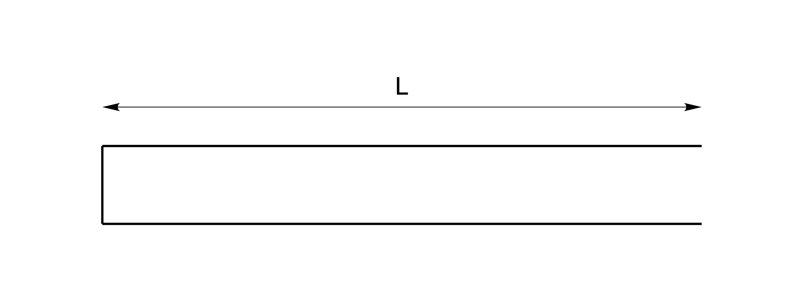
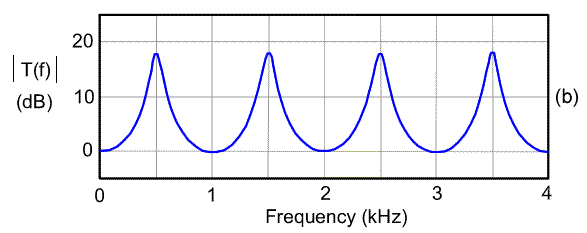
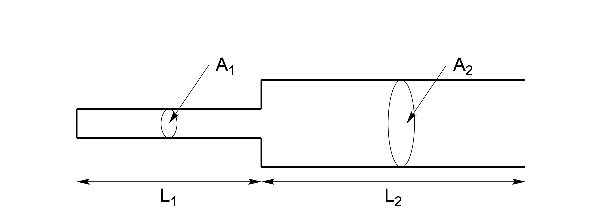
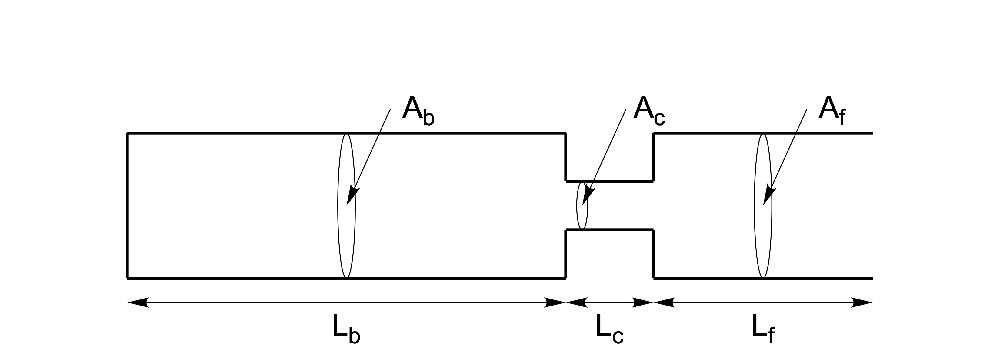
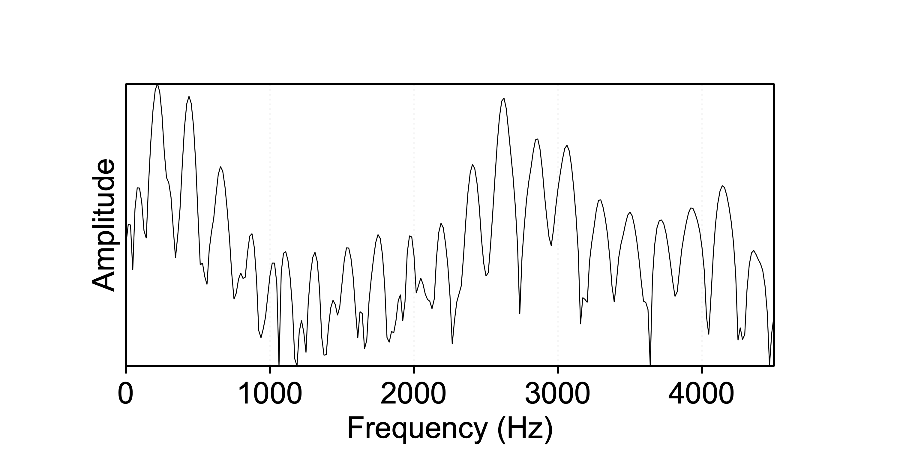
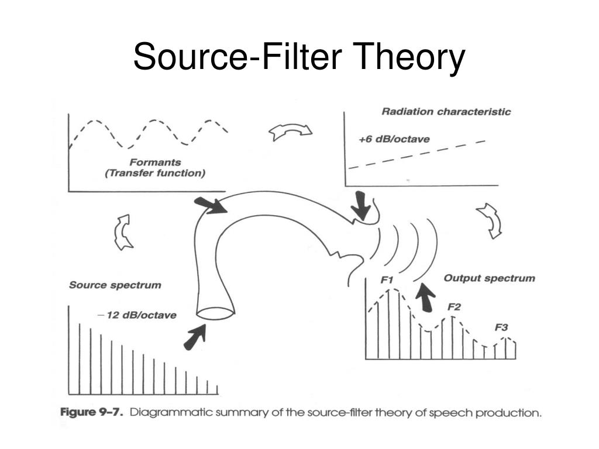

# (PART\*) Part II: Speech {-}

# Speech sounds {#ch-speechsounds}

*Chapter keywords*: resonance, formant, formants, tube, tube model, spectral slope, source, filter, radiation, source-filter model, speech production, vowels, phonation, consonants, ingressive, egressive, noise, closure, constriction, phonation, voicing. 

## Resonance {#sec:resonance}

Imagine that you tap a glass object with a metal object -- briefly and not too hard. The glass resonates at a particular frequency, which depends on the shape and mass of the glass, and you hear a resounding 'ting' sound. What is going on? 

Your tapping force initiates many different vibrations within the glass. Some of these vibrations have a wavelength (§\@ref(sec:wavelength)) that equals the dimensions of the glass. The vibrations at these particular wavelengths are reinforced, while other non-matching vibrations are attenuated. This is termed **resonance**. The amplified frequencies are termed 'resonant frequencies' or 'natural frequencies'. The primary resonant frequency, which is amplified the most, is also termed the 'eigen' frequency of the resonating object. Very quickly, the non-resonant frequencies are dampened out, and the glass continues to vibrate at its resonant frequency (or frequencies). The vibrating glass constitutes a sound source, the sound of which propagates in the surrounding air (see Ch.\@ref(ch-soundwaves)), and we hear a 'ping' sound. The envelope (§\@ref(sec:envelope)) of this 'ping' sound depends on the material (composition), mass, and shape (and contents) of the vibrating object.

Almost all physical bodies have a tendency to resonate at their natural frequencies: not only a glass but also a pendulum, a swing, a bridge, all musical instruments, a rope on a flagpole [@Minnaert_1970v2, §61], the column of air in an organ pipe, the volume of air in a hall or venue -- and, importantly, also the body of air in the human vocal tract.  

As a first approximation, let us consider a simple straight tube, uniform in diameter over its entire length, filled with air of 37°C, open at one end and having a sound source at the other closed end, as illustrated in Figure \@ref(fig:onetube). This is an *idealization* of e.g. an organ pipe, a flute, or of a human speaker producing a continuous schwa vowel /ə/. (It differs somewhat from a concert hall, in that the tube is open at one end.). 

```{r onetube, echo=FALSE, fig.cap="Uniform straight tube of length L, open at one end, and having a sound source at the closed end. After Stevens (1998), Figure 3.8.", fig.align="center"}

```

The principle of resonance is explained by Christian Huygens as follows (in a letter in November 1693):

> "Because every sound, or rather noise, which is repeated in equal and very small intervals, produces a [periodic] musical tone; similarly the length of an organ pipe determines its [resonant] tone, because the vibrations of air arrive at small intervals of time which are equal to the time which [the vibrations] need to move back and forth through the length of the organ pipe, as it is closed at one end." [@Huygens_1905, p.571, transl. HQ]

The natural frequencies resonate (are amplified) because their wavelength matches the length $L$ of the tube: the compressions and rarefactions of a wave period going "one way" coincide with those of the reflected wave going the "other way", so that the amplitudes of the pressure variations add up, and thus increase, for some frequencies, viz. the resonant or natural frequencies. Sound waves with frequencies close to the resonant frequencies are thus amplified and those with other frequencies are attenuated^[In other words, the tube acts as a bandpass filter around its natural frequencies, albeit with a filter characteristic different from the one illustrated in Fig.\@ref(fig:bandpassfilter).].

## Formants {#sec:formants}

### one uniform tube {#sec:onetube}

Above, we discussed the resonance in an ideal, uniform tube (straight, and closed at one end, see Fig.\@ref(sec:onetube)). This tube may be regarded as a single tube with the same (uniform) diameter across its length, and it is similar to the vocal tract of a human speaker producing a continuous schwa vowel /ə/. This vocal tract acts as a single resonator: it amplifies its natural frequencies and attenuates other frequencies. 

The natural frequencies of such a uniform tube are 
$$F_n = \frac{2n-1}{4} \cdot \frac{c}{L}$$
where $n$ is the ranking number of the natural frequency, $c$ is the speed of sound (353 m/s, see §\@ref(sec:speedofsound)), and $L$ is the length of the tube [@Stevens_1998, p.139] ^[And the corresponding *wavelengths* of these natural frequencies are $\frac{4}{2n-1}\cdot L$ [@Nooteboom_Cohen_1984, p.60].].
If we assume that the vocal tract of an adult male speaker has length $L=0.17$ m, then the first resonant frequency of this speaker's vocal tract would be at $F_1 = \frac{1}{4} \cdot \frac{353}{0.17} = 519\ \textrm{Hz}$. In reality, the natural frequency is slightly lower^[This is due to absorption and radiation and to the vocal tract being not straight but bended, all of which factors are outside the scope of this introductory text.] at $F_1 \approx 500\ \textrm{Hz}$.
Similarly, his $F_2 \approx 1500\ \textrm{Hz}$ and $F_3 \approx 2500\ \textrm{Hz}$, etc, as shown in Figure \@ref(fig:uniform-vt-transfer).
A female vocal tract is slightly shorter than that of a male speaker (we assume $L=0.15$ m for a female vocal tract), thus we find that for a female vocal tract her $F_1 \approx 550\ \textrm{Hz}$, $F_2 \approx 1650\ \textrm{Hz}$ and $F_3 \approx 2750\ \textrm{Hz}$. 

These natural frequencies of the vocal tract are termed its **formants**, a term coined by Ludimar Hermann (1838--1914)^[Formants are a property of the tube or of the vocal tract (and of the medium in it), and not of the sounds coming out of that tube or tract, but this distinction is seldom relevant and seldom made.]. 

Figure \@ref(fig:uniform-vt-transfer) shows the transfer function and formants of the uniform vocal tract (open at one end) of a male speaker. This figure is to be interpreted like a spectrum (§\@ref(sec:spectrum)) or bandpass filter response (Fig.\@ref(fig:bandpassfilter)).

```{r uniform-vt-transfer, echo=FALSE, fig.cap="Overall transfer function of the (uniform and open) vocal tract of a male speaker. Adapted from Stevens (1998), Fig.3.3(b); from <https://www.mq.edu.au/faculty-of-medicine-health-and-human-sciences/departments-and-schools/department-of-linguistics/our-research/phonetics-and-phonology/speech/acoustics/acoustic-theory-of-speech-production/vocal-tract-resonance>", fig.align="center"}

```

A single formant is characterised by two properties: 

- its peak *frequency*, or formant frequency, 

- its *bandwidth* or 'peakness', that is the width of the spectral envelope $3$ dB below the peak amplitude of that formant; a larger bandwidth value corresponds with a wider, flatter, and less peaked formant^[The term *formant quality* may refer to the inverse of the formant bandwidth, i.e. $1/\textrm{bandwidth}$; a larger quality value corresponds with a narrower, higher, and more peaked formant.]. 

### multiple tubes {#sec:moretubes}

A special property of the *human* vocal tract is that is not a fixed tube, such as the one-tube idealization above, but that it can be *articulated*^[in the classical sense of "having two or more sections connected by a flexible joint" (*New Oxford Dictionary of English* 1998).] into multiple tubes, with varying shapes and varying cross-sections. This *articulation* of the vocal tract allows humans to produce many different vowel and consonant sounds, with different phonetic properties. Thus **the articulated and articulating vocal tract allows humans to convey linguistic meaning by means of speech.**

First we look at the two-tube configuration in Figure \@ref(fig:twotube) [after @Stevens_1998, Fig.3.13, p.143]; this is similar to the human vocal tract producing a low vowel /ɑ/. Due to the low position of the jaw and the tongue, the pharynx is relatively narrow while the oral cavity is relatively wide. This system of two tubes acts as a single system of two *coupled* resonators. The natural frequencies depend on the respective lengths $L_1$ and $L_2$ and the respective cross-sections $A_1$ and $A_2$, that is, the natural frequencies of the narrower tube affect those of the wider tube, and vice versa. This coupling results in a higher $F_1$ and lower $F_2$ for this two-tube configuration [@Stevens_1998, Fig.3.14], relative to those for the uniform tube (§\@ref(sec:onetube)). Indeed, for /ɑ/, average formant values are (for males) $F_1=730$ and $F_2=1090$ Hz, and (for females) $F_1=850$ and $F_2=1220$ Hz. 

```{r twotube, echo=FALSE, fig.cap="Two-tube configuration, with two coupled resonators. After Stevens (1998), Figure 3.13.", fig.align="center"}

```

Even more complex is the configuration in Figure \@ref(fig:threetube) [after @Stevens_1998, Fig.3.15, p.144]; it is similar to the human vocal tract producing a high vowel /i/. Due to the high and front position of the tongue, the vocal tract is divided (articulated) into a back and a front cavity, with a relatively narrow constriction separating the back and front cavities. The overall length $L$ of the vocal tract remains constant. Each of the three tube sections has its own natural frequencies, which also affect one another, the interaction depending on the lengths and areas of the tube sections. For the configuration shown in Fig.\@ref(fig:threetube), the natural frequencies come out as approximately $F_1=300$ Hz (mainly due to constriction), $F_2=1900$ Hz (back cavity), and $F_3=2200$ Hz (front cavity) [@Johnson_2012, p.137] for a male vocal tract. 

```{r threetube, echo=FALSE, fig.cap="Three-tube configuration, with a back cavity (left), constriction, and front cavity (right). After Johnson (2012), Figure 6.3.", fig.align="center"}

```

In the spectrum of the recorded /i/ vowel produced by a *female* speaker, in Fig.\@ref(fig:speech-spectralslice-i), we see that harmonics are amplified around formants $F_1 \approx 400\ \textrm{Hz}$ and $F_2 \approx 2600\ \textrm{Hz}$. The $F_3 \approx 3000\ \textrm{Hz}$ is poorly visible in this spectrum. This formant pattern characterizes an /i/ vowel spoken by an adult female speaker [@Peterson_Barney_1952, Table II].  

```{r speech-spectralslice-i, echo=FALSE, fig.cap="Spectral slice of the /i/ vowel in the word *speech*.", fig.align="center"}

```

Formants are numbered by their peak frequency, and are named 'F1', 'F2', 'F3', etc. (The fundamental frequency of a sound is called $f_0$, see \@ref(sec:FTintro).)
The different vowels in any language have different formant patterns, and the first two or three formants are most important for distinguishing vowels. Because various sections of the articulated vocal tract have *interacting* resonances (as explained above), formant frequencies cannot be mapped easily on articulatory features. Nevertheless, with considerable simplification, there is a negative correlation between vowel F1 and the height of the tongue (lower tongue, higher F1, see Fig.\@ref(fig:twotube)), and between vowel F2 and the front--back position of the tongue (more fronted tongue, higher F2, see Fig.\@ref(fig:threetube)). These patterns are typically illustrated in a diagram depicting vowel formants in the F1-by-F2 plane^[In that diagram, the scales may be displayed in Bark units, and the F1 axis may have been reversed, in order to clarify the relation between articulatory features and formant frequencies.], in your phonetics textbook. F3 is involved in the contrast between rounded and unrounded vowels (such as /i/ vs. /y/).

For further background on *formants*, see [@Aalto_Malinen_Vainio_2018].


### How to measure formants

::: {#box-praatformants .praatbox}

The safest method for measuring formants is to *bypass* the spectrum, and measure formants directly from a Sound object.


- Select an input Sound object in the `Praat` Objects window. Then choose `Analyse spectum >` and then `To formant (burg)...`. 

- As we saw above, for a male speaker we may expect 5 formants in the range from 0 to 5000 Hz. For a female speaker, having a slightly shorter vocal tract than a male speaker, we may expect 5 formants in the range from 0 to 5500 Hz. Choose appropriate `Maximum number of formants` and choose the matching `Formant ceiling` value for your speaker; these values depend on the length of the speaker's vocal tract and on your sampling frequency (§\@ref(sec:samplingfrequency))^[See the `Help` information in the `Praat` menu, in particular its last paragraph.]. 
Leave other arguments at their default (standard) values. Click `OK`.

- The resulting Formant object is again added at the bottom of the list of objects. 

- You may `Draw` or `Tabulate` or interactively `Query` the formant values (frequencies and bandwidths per formant per time frame). 

- Remember to `Save` the Formant object if you wish. 
:::

## Source-filter theory of speech production {#sec:sourcefilter}

According to the source-filter theory, speech is produced by first generating a source sound, which is subsequently modified by an acoustic filter [@Fant_1970]. The theory postulates that source and filter are two independent and subsequent components in speech production, in particular, that the filter does not affect the source (although source-filter interactions do occur in actual speech production; @Tokuda_2021, §4). 

Several types of **source** sounds may be generated, separately or in combination, of which the most important are:

- phonation (periodic sound produced by vibration of the vocal cords),

- whisper (aperiodic sound produced by air turbulence at the glottis), 

- explosion or frication (aperiodic sound produced by air turbulence at a constriction in the vocal tract),

- ingressive sounds (e.g. clicks; aperiodic and transient sound produced at a constriction in the vocal tract, with ingressive airstream).

These source sounds are then modified by the acoustic **filter**, formed by the (part of the) vocal tract that is between the sound source and the outside air. The shape of that (part of the) vocal tract may be varied (articulated), with noticeable and meaningful phonetic effects. The (part of the) vocal tract works as a filter, by means of resonance (§\@ref(sec:resonance)). Figure \@ref(fig:source-filter) summarizes the model for the production of vowels with phonation as source sound. 

```{r source-filter, echo=FALSE, fig.cap="Diagrammatic summary of the source-filter theory of speech production; figure by Perry C. Hanavan, from <https://image.slideserve.com/325813/source-filter-theory34-l.jpg>.", fig.align="center"}

```

Figure \@ref(fig:source-filter) also illustrates a third component of the source-filter theory of speech production, viz. the effect of sound **radiation** at the lips. The radiation may be regarded as a high-pass filter with an overall slope of $+6$ dB per octave (§\@ref(sec:typesoffilters))^[Components with lower frequency suffer more from acoustic impedance at the border between the vocal tract and the outside air, and these lower-frequency components are therefore attenuated in the resulting speech sound.] ^[This spectral effect of radiation is often regarded as if it were a spectral property of the source sound, after which this radiation is further ignored.]. 

### Production of vowels {#sec:vowelproduction}

Figure \@ref(fig:source-filter) illustrates how **vowels** are typically produced. The source sound is the voicing sound (phonation) generated by the vibration of the vocal cords in the larynx. (The *glottis* is the opening between the two vocal folds.) This phonation sound has a spectral slope of about $-12$ dB per octave. This phonation sound is subsequently modified or filtered by the vocal tract, which amplifies certain frequencies (*formants*, §\@ref(sec:formants)). Finally the filtered sound is radiated from the lips, which modifies the spectral slope by $+6$ dB per octave. The resulting vowel sound has an overall spectral slope of $-6$ dB per octave, as mentioned in §\@ref(sec:emphasisfilters) above.

Remember that *harmonics* including $f_0$ depend on the source signal (phonation), while *formants* depend on the filter (vocal tract). Consequently, a formant frequency does not have to coincide with a harmonic: in the output spectrum in Fig.\@ref(fig:source-filter), for example, F1 falls between the second and third harmonic. 

### Production of consonants

For **voiceless** (and egressive) consonants, e.g. /s, k/, the source sound is the turbulent noise generated at a constriction or closure of the vocal tract; this source sound may be regarded as white noise (§\@ref(sec:noise)). This noise typically has a flat spectral slope ($0$ dB per octave). This noise sound is subsequently modified or filtered by the part of the vocal tract that is between the place of closure or constriction, and the outside air; certain frequencies are amplified and other frequencies may be attenuated. \

**Ingressive** consonants are produced by the same acoustic-phonetic processes, albeit with an ingressive (inward) air stream. 

For **voiced** (and egressive) consonants, e.g. /z, b/, the situation is more complex: typically two source sounds are generated *simultaneously*: a turbulent noise sound generated at a constriction or closure in the vocal tract, as well as a voicing sound (phonation) generated by the vibration of the vocal cords in the larynx. The periodic voicing sound is filtered by the entire vocal tract, as vowels are, while the aperiodic (noise) sound is filtered only by the 'downstream' part of the vocal tract. 
Because the egressive airstream from the lungs is used to drive the phonation at the larynx, the noise generated inside the vocal tract is considerably weaker for voiced plosive and fricative consonants than for their unvoiced counterparts. In fact, it is somewhat difficult to generate two sounds simultaneously, as the two sound generation processes tend to counteract each other. 
