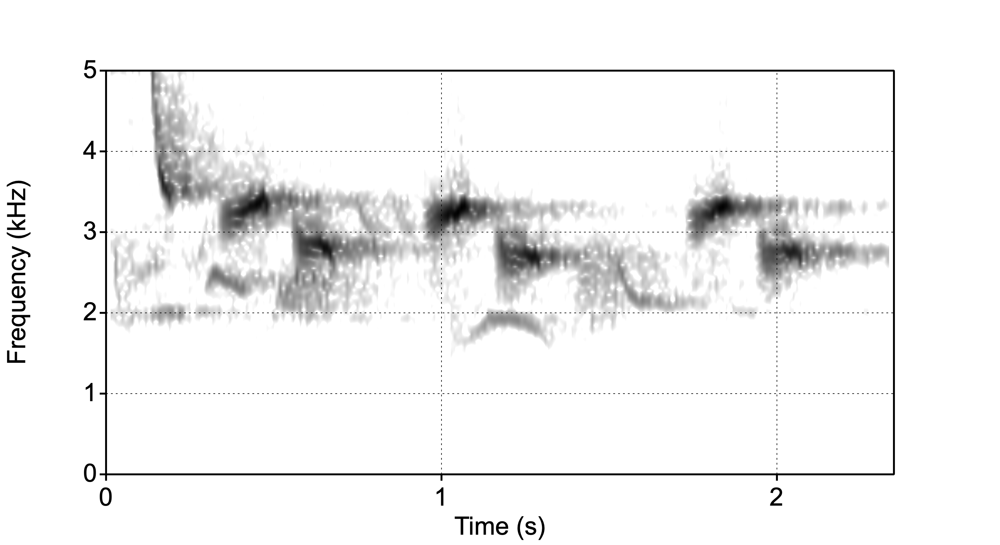
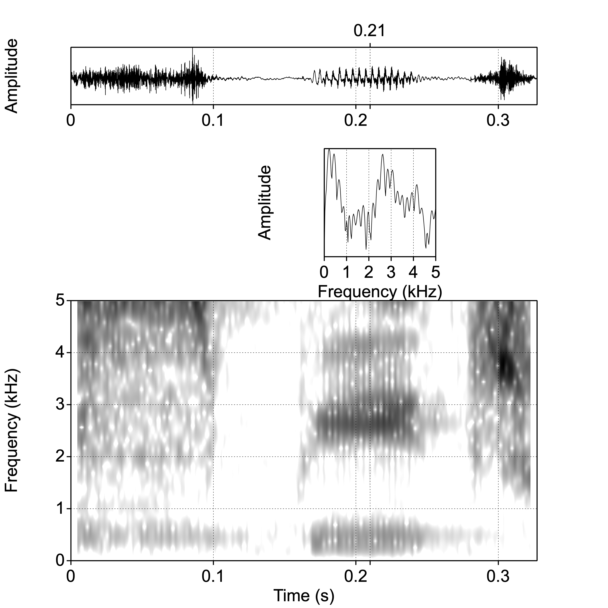
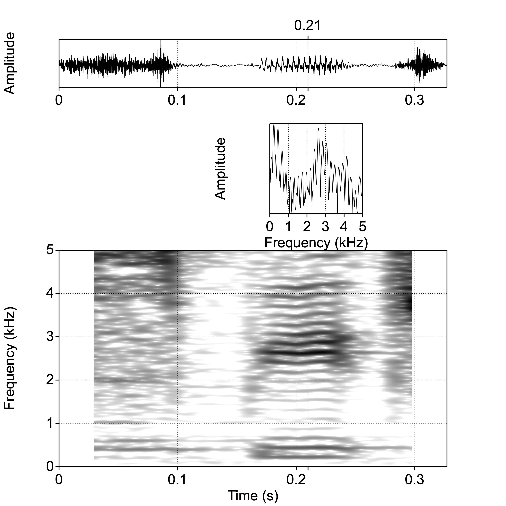
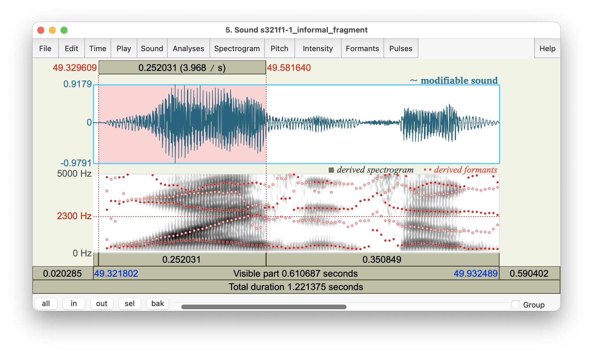

# Spectrograms {#ch-spectrograms}

*Chapter keywords*: spectrogram, center frequency, bandwidth, broadband, narrowband, detail, smearing, formant, amplitude, frequency, time, component, harmonic, glottal pulse.  

## Introduction {#sec:spectrogram-intro}

As we saw, a spectrum (§\@ref(sec:spectrum)) shows the various frequency components of a complex signal, such as the formants of a vowel (§\@ref(sec:formants)). However, a spectrum either shows the frequency composition of an entire digital sound, or it shows the frequency composition of a brief 'slice' or frame or window of that sound (box \@ref(sec:spectrum)). 

In order to track spectral changes over time, we need a series of spectral slices, measured at fixed intervals. Thus we wish to depict three dimensions: time, amplitude, and frequency. This most important visualisation in speech analysis is called a **spectrogram**. As in an oscillogram, *time* is shown along the horizontal axis. Like in a spectrum, but rotated by 90°, *frequency* is shown along the vertical axis. *Amplitude* is shown in the degree of darkness (or in coloring). 
The example spectrogram in Figure \@ref(fig:merel-spectrogram) visualizes a blackbird song, showing the amplitudes (darkness) of the frequency components (vertically), varying over time (horizontally). 

```{r merel-spectrogram, echo=FALSE, fig.cap="Spectrogram of a brief part of song by a blackbird.", fig.align="center"}

```

In this spectrogram you see an initial steeply falling 'chirp' sound, followed by three repetitions of a two-tone 'syllable', against a background of other birdsong. 

Spectrograms used to be made by means of a special device, a sonagraph or spectrograph, which worked by means of a bandpass filter (Fig.\@ref(fig:bandpassfilter)). This bandpass filter was initially set to a low *center frequency*, then applied to the sound recording, and the resulting output amplitude of the filter was printed as varying degrees of darkness, resulting in a single horizontal 'line' of the figure. Then the frequency band of the filter was increased slightly, to produce the next 'line' of the figure. This was repeated across the entire range of frequencies^[Thus a spectrograph required several minutes to produce a single spectrogram.]. Moreover, a spectrograph used to have two fixed settings for the *bandwidth* of the band-pass filter (§\@ref(sec:filterbandwidth)): 260 Hz for so-called broadband spectrograms, and 43 Hz for narrowband spectrograms, respectively. (Nowadays, in digital speech analysis, bandwidth is controlled indirectly, via the length of the window for spectral analysis, see §\@ref(sec:spectralslice) and see below).

## Broadband spectrogram

In a broad-band spectrogram, as in Fig.\@ref(fig:speech-word-spectrogram-broad), the bandwidth used in the spectral analysis is relatively wide (by convention, 260 Hz).

```{r speech-word-spectrogram-broad, echo=FALSE, fig.cap="Oscillogram, broad-band spectrum at 0.210 s, and broad-band spectrogram of the word *speech*.", fig.align="center"}

```

The wide bandwidth results in less detail (more smearing) in the frequency dimension, while allowing more detail in the time dimension. We can see temporal events in great detail, such as individual periods of voiced parts, and noise bursts in plosive or affricate consonants. On the other hand, frequencies are blurred or smeared. This makes it easier, however, to see formants (§\@ref(sec:formants)) in the vowels, and to see other "broad" spectral properties in the consonants.   

## Narrowband spectrogram

In a narrow-band spectrogram, as in Fig.\@ref(fig:speech-word-spectrogram-narrow), the bandwidth used in the spectral analysis is relatively narrow (by convention, 43 Hz).

```{r speech-word-spectrogram-narrow, echo=FALSE, fig.cap="Oscillogram, narrow-band spectrum at 0.210 s, and narrow-band spectrogram of the word *speech*.", fig.align="center"}

```

The narrow bandwidth results in more detail in the frequency dimension, while allowing less detail (more smearing) in the time dimension. We can see frequencies in great detail, such as individual harmonics in voiced parts. On the other hand, brief temporal events such as noise bursts are blurred or smeared. 

::: {#box-praatspectrogram .praatbox}

## How to make a spectrogram {#sec:howto-spectrogram}

There are two ways to create a spectrogram of a sound recording: either directly, or by means of the SoundEditor. 

### to Spectrogram directly

- Select an input Sound object in the `Praat` Objects window. Then choose `Analyse spectum >`, then `To Spectrogram...`. 

- The parameter `Window length` determines the filter bandwidth used to create the spectrogram. For a broadband spectrogram, choose $0.005\ \textrm{s}$; for a narrowband spectrogram, choose $0.030\ \textrm{s}$. 
For the spectrogram of birdsong in Fig.\@ref(fig:merel-spectrogram), an intermediate value of 0.015 s was used.\
Set `Window shape` to `Gaussian`.\
Leave other arguments at their default (standard) values. Click `OK`.

- The resulting Spectrogram object is again added at the bottom of the list of objects. 

- You may `Draw > Paint...` the spectrogram. Specify the time and frequency range, as well as the dynamic range (of amplitude in dB, between darkest and lightest colour).\
The `Pre-emphasis` slope helps in discerning visual details in the higher frequencies, as explained in §\@ref(sec:emphasisfilters) and §\@ref(sec:vowelproduction); the default value of $+6$ dB per octave works well in most situations. 

- Remember to `Save` the Spectrogram object if you wish. 

### from SoundEditor {#sec:spectrogramsoundeditor}

This method is similar to the spectral analysis described in §\@ref(sec:spectralslice). Using this method, your spectrogram in the SoundEditor is immediately updated if you change (`Apply`) values for the analysis parameters (which may be convenient), but extracting and saving the Spectrogram requires some extra work. 

- In the `Praat` object window, select a Sound object.

- Next, in the `Praat` object window, choose `View & Edit`. This will open a so-called SoundEditor window, with the oscillogram as its main feature. 

> TODO crossref SoundEditor

- In the SoundEditor window, go to `Spectrogram...` and then `Spectrogram settings`. 

- The parameter `Window length` determines the filter bandwidth used to create the spectrogram. For a broadband spectrogram, choose $0.005\ \textrm{s}$; for a narrowband spectrogram, choose $0.030\ \textrm{s}$. 
For the spectrogram of birdsong in Fig.\@ref(fig:merel-spectrogram), an intermediate value of 0.015 s was used.\
Set the `Dynamic range` (of amplitude in dB) between darkest and lightest colour to some value between $40$ and $55$ dB (try different values by using `Apply`, and notice the differences in the resulting spectrogram). 
Leave other arguments at their default (standard) values. Click `OK`.

- Make sure that you can see the Spectrogram in the SoundEditor, by selecting the option `Spectrogram > View Spectrogram`. This setting is saved from session to session, so you may have to switch `on` the spectrogram view.  

- If you are happy with the spectrogram in the SoundEditor panel, you can then choose `Spectrogram > Paint visible spectrogram...` in order to draw that spectrogram in the Picture window. 

- You can also `Extract` and then `Save` the spectrogram from the SoundEditor in order to save it as an object in the Objects window. 

:::

## How to read a spectrogram {#sec:readspectrogram}

(with Clizia Welker)

::: {#box-spectrogram .warningbox}

This section intends to provide some hints on how to read a spectrogram. The skill of reading a spectrogram is highly useful whenever you need to *annotate* a speech recording, that is, dividing or segmenting it into syllables or phones, and/or transcribing (labeling) the words or sounds spoken. For more detailed explanations, please refer to your textbooks on phonetics (for recommended textbooks see §\@ref(sec:textbooks)), and see Chapter \@ref(ch-annotation) on annotating speech. Also consult the valuable instructions and background on [how to read a spectrogram](https://home.cc.umanitoba.ca/~robh/howto.html) by Rob Hagiwara.  

::: 

While by observing an oscillogram it is only possible to identify broad phonetic classes, the spectrogram provides us with sufficient information to determine the phones. It is possible to deduce the phones (with good chances of success) by exploiting information about

- the frequency values of the formants,

- the energy pattern throughout the spectrogram,

- the formant transitions (from vowel to consonants and from consonants to vowels).

Except for the formant transitions (see below), these features may be found in a spectrum too, but spectrograms allow us to inspect these features over time. 

In order to read a spectrogram, we need to remember that:

- the darker regions are frequency regions with a high degree of energy (§\@ref(sec:spectrogram-intro)),

- the dark band at the bottom of the spectrogram displays the $f_0$ in voiced parts; it may be difficult to distinguish fundamental $f_0$ from formant F1 (especially in closed vowels, which have a low F1 close to $f_0$ ^[If speaking or singing at high fundamental $f_0$, the $f_0$ may even be higher than F1, thus rendering F1 inaudible.]),

- vowels are characterised by a clear formant pattern (§\@ref(sec:formants)), visible as horizontal dark bands,

- consonants (especially voiceless ones) do not have a clear formant pattern, but the distribution of energy throughout the spectrum helps us identifying them,

- the vertical bands at regular time intervals in the broad-band spectrogram correspond to the glottal pulses (cycles of opening and closing of the vocal folds).

**Vowels** may be distinguished through their formant values, especially through F1, F2 and F3; consult a vowel diagram in your textbook. 

**Dipthongs** (such as the vowels in the Dutch words *bij*, *bui*, *bouw*, and in the English words *mouth*, *choice*, *price*, *face*) are composed of two different vowel sounds, with a gradual movement of the formants from their initial to final frequency values (for an example, see Fig.\@ref(fig:window-soundeditor-3) below). 

For **voiced consonants** in a CV context, formant frequencies change relatively rapidly. The *F2* value in the vowel from which the formant travels in this formant transition is often called the 'F2 locus', and this locus is correlated with the place of articulation of the consonant. The F2 transition is also due to the fact that acoustic resonators (tube sections) are uncoupled at the moment of closure or frication, but become coupled as the mouth opens.
For labial consonants the F2 locus is around 700 Hz, for alveolar consonants it is around 1800 Hz, and for velar consonants it is around 2700 Hz.   
In CV context, rapid F1 transitions are related to the degree of jaw opening, with F1 increasing from zero to its vowel value during opening of the mouth.   
In VC contexts we see similar patterns as in CV contexts, but reversed in time.

While **voiceless consonants** are not characterised by formants (even in an intervocalic context), their place of articulation may be assessed by looking at which frequency regions display a high concentration of energy. Moreover, in CV context, the rapid F2 transitions may seem to travel from the same F2 locus as for corresponding voiced consonants with the same place of articulation, albeit with formants less visible in transitions involving voiceless consonants.

The distinction between voiced and voiceless plosive consonants largely depends on the **voice onset time (VOT)**, "defined by the time elapsed between the release of the stop consonant constriction (sometimes called the “burst”) and the onset of periodicity in the following voiced segment" [@Rubin_2022]. The release or burst is visible as a brief noise segment; the following voiced segment typically has initial formant transitions (see above), and visible glottal pulses or visible harmonics (see above). 

In producing **alveolar** consonants, the vocal tract is divided into two smaller cavities: a large back cavity, and a small front cavity between the alveolar obstruction and the outside air. Due to its small size, the front cavity yields resonances in the higher frequency regions, as we can see in the initial consonant [s] in Fig.\@ref(fig:speech-word-spectrogram-broad). In **palatal** consonants (such as the final consonant in the same spectrogram), the place of artiulation is more backward, the front cavity is larger, and the so-called 'spectral centre of gravity' in the resulting consonant is correspondingly lower. 

**Nasal and lateral** consonants are phonetically complex. They resemble vowels, but the vocal tract has additional cavities during the production of these sounds: for nasals, the nasal cavity, and for laterals, additional cavities under and aside of the tongue. The resulting sound has resonances due to these cavities, as well as anti-resonances due to the acoustic *coupling* between branching cavities. 

For more tips and tricks and background about how to identify speech segments in a spectrogram, please consult your textbooks on phonetics, as well as the resources mentioned in the first paragraph of this section. 

## More about using the SoundEditor {#sec:soundeditor3}

In several sections above we have encountered the SoundEditor: in §\@ref(sec:praatsoundeditor) and in §\@ref(sec:spectrogramsoundeditor). Please re-read those sections before you continue. 
The powerful SoundEditor provides you with lots of information about the sound recording: oscillogram, spectrogram, formant analysis, as well as prosodic information (which will be discussed further in Chapter \@ref(ch-prosody)). 
Here we provide some additional instructions not yet covered in the sections above. 

::: {#box-soundeditor-3 .praatbox}

- Select an input Sound object in the `Praat` Objects window. 

- Choose `View & Edit`.
This will open a **SoundEditor** window.
Figure \@ref(fig:window-soundeditor-3) shows an example of a SoundEditor, displaying the fragment *why is it so good* spoken by a female speaker of English; the single word *why* is highlighted. 

```{r window-soundeditor-3, echo=FALSE, fig.cap="SoundEditor window, showing oscillogram and spectrogram of the fragment *why is it so good...*, with the word *why* highlighted.", fig.align="center"}

```

::: {#box-windowsfile-details-again .smallprintbox}

The SoundEditor in Fig.\@ref(fig:window-soundeditor) shows a fragment of speech, taken from the audio recording named `s321f1-1` from the Longitudinal UCU English Accents corpus (LUCEA; @Orr_Quené_2017). The utterance shown is taken from the informal monologue part of that recording. 

:::

In this example, the SoundEditor shows the oscillogram (§\@ref(sec:oscillogram)), the spectrogram (Ch.\@ref(ch-spectrograms)), as well as formant frequencies (§\@ref(sec:formants)) overlaid. Although the formants do match the dark bands in the oscillogram, the ranking of formants to spectral peaks may be off, e.g. around the boundary between *why* and *it*. 

You can ask `Praat` to report to its Info window the time of the cursor (`Time > Get cursor`), the frequency of the cursor in the spectrogram (`Spectrogram > Get frequency at frequency cursor`) and the spectral power at the cursor in the spectrogram (`Spectrogram > Get spectral power at cursor cross`). You can also query each formant frequency (`Formants > Get first formant`, etc); see §\@ref(sec:formants) for more explanation about formants. 

A helpful command to know in the SoundEditor is `Formants > Formant listing`. This will show the frequencies and bandwidths of *all* formants. If you have selected part of the sound, then *all* formant measurements at *all* time points in the selection will be listed. Otherwise, *all* formants at the current time point will be listed. 

`Praat` writes its output to its `Info` window, the contents of which may be saved. 

:::

<P>

::: {#box:clearinfo .warningbox}

In `Praat`, each new writing action such as `Query`, `Get`, `Tabulate`, `Info`, etc, first **clears** the Info window, and thus any existing content in the Info window is **erased**. If you wish to keep information from the Info window, you have to `Save` or export its contents *before* the next writing action!

You can also clear the Info window manually, by choosing `File > Clear` within the Info window.  

:::
