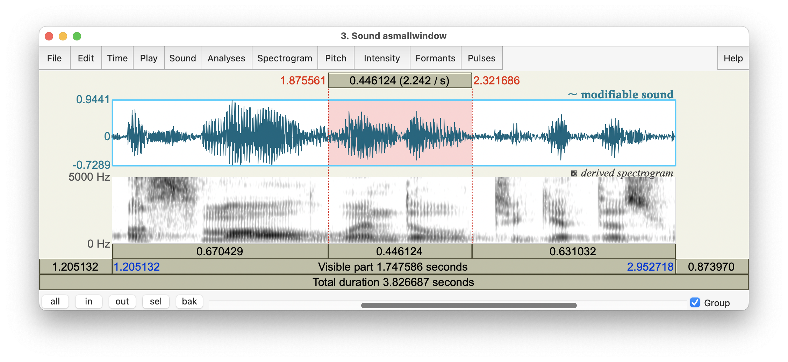
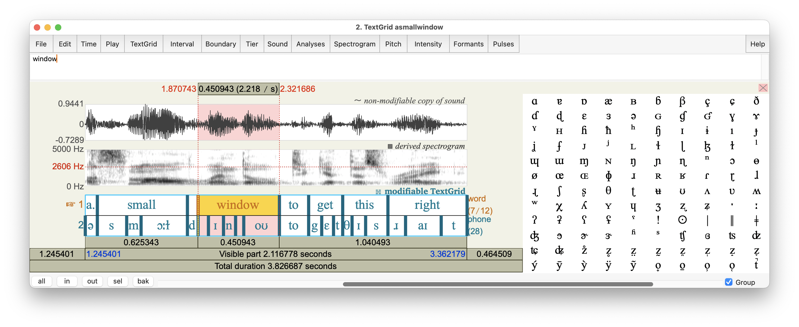

# Annotating speech sounds {#ch-annotation}

*Chapter keywords*: phonetics, linguistic units, sounds, coarticulation, annotating, annotation, segment, segments, segmenting, label, labels, labeling, transcribing, transcription, symbol, TextGrid, SoundEditor, TextGridEditor. 

## Introduction {#sec:coarticulation-intro}

Annotating speech is at the core of phonetic analysis. Annotation means that abstract linguistic symbols are linked to the concrete physical speech stream --- somewhat similar to subtitling. 

Most projects involve some sort of annotation of speech, as researchers may be interested in e.g. how an intended (abstract) sound is produced acoustically-phonetically, how a meaningful phonological contrast is realized in speech, how an acoustic-phonetic feature such as F2 locus is perceived, etc.

In spoken language, speakers realize abstract linguistic sound units in the form of articulatory gestures and movements and positions. The articulatory movements from one sound to the next require complex motor coordination in space and in time. In turn, this strongly affects the speech stream: the resulting speech sounds are not clearly related to the intended or the canonical linguistic sound units. Instead, the articulatory commands and their acoustic effects are smeared out over time, affecting neigboring speech sounds: this is called **coarticulation**, and you can read more about this in your phonetics textbook. As a result, speech is not analogous to but very different from typed or printed text; speech is rather analogous to and more similar to cursive *handwriting*. 

The complex relation between linguistic and spoken units is illustrated in Figure \@ref(fig:window-soundeditor-again) which is a copy of Figure \@ref(fig:window-soundeditor). 

```{r window-soundeditor-again, echo=FALSE, fig.cap="SoundEditor window, showing oscillogram and spectrogram of the fragment *...a small window to get this...*, with the word *window* highlighted.", fig.align="center"}

```

::: {#box-windowsfile-details-again .smallprintbox}

The SoundEditor in Fig.\@ref(fig:window-soundeditor-again) shows a fragment of speech, taken from the audio file named  `10-18-17_Council_SLASH_10-18-17_Council_DOT_HD_DOT_mp3_00285.flac` from the *Peoples Speech* corpus at <https://huggingface.co/datasets/MLCommons/peoples_speech>. For details about that corpus, see @Galvez_Diamos_Ciro_Cerón_Achorn_Gopi_Kanter_Lam_Mazumder_Reddi_2021.

:::

Figure \@ref(fig:window-soundeditor-again) illustrates several important characteristics of casual, fluent speech:

* Boundaries between discrete speech segments are not clearly present, due to coarticulation. For example, there is strong articulatory and acoustic overlap between the vowel and the final consonant of [smɔɫ] *small*, making it almost impossible to demarcate these two sounds. 

* Some speech segments have hardly any acoustic-phonetic manifestation at all, e.g. the final consonant of *get*;

* Some speech segments are difficult to transcribe, e.g. the vowel in the last syllable of *window*: diphthong [ˈwɪndoʊ] or monophthong [ˈwɪndoː] ?

* You may also notice the F2 locus of the [d] in *window*, at 2.118 s and ~1800 Hz, see §\@ref(sec:readspectrogram), voiced consonants.

Subsequently, listener retrieve the indended units (sounds, words, meanings) from this continuous speech stream. In sum, segmenting and labeling speech addresses the core issue in phonetics, viz. how abstract linguistic units and meanings are related to their concrete physical realizations, both in production and in perception of spoken language. 

In this chapter on annotation, we discuss **segments**, and thus we assume that speech sounds or segments have unambiguous boundaries. We also discuss **labels** (transcription), and thus we assume also that speech segments can be unambiguously labeled and identified as linguistic units. Nevertheless, we need to remember that actual speech sounds (speech segments, or phones) do not have a clear one-to-one relation with abstract linguistic units (phonemes). 

::: {#box-praattextgrid .praatbox}

## TextGrid objects {#sec:textgrids}

Annotation involves both segmentation (defining boundaries between speech intervals) and labeling or transcribing (assigning symbol labels to those intervals). In `Praat`, the object that holds this type of information (boundaries, time points, and labels) is called the **TextGrid**. 

A `TextGrid` object may contain multiple layers, or `tiers`, of annotation. As a first example, a TextGrid of a single-speaker recording may have one layer of word-level transcription in regular orthography (spelling), a second layer of phone-by-phone phonetic transcription, and a third layer marking special moments of interest to the researcher, e.g. the moment of maximum intensity of a vowel. As a second example, a TextGrid of a dialogue recording may contain two layers of word-level transcription, one for each speaker in the dialogue. These examples illustrate two distinct types of layers or tiers within a TextGrid object:

- `interval tiers` containing time intervals (corresponding with e.g. words, phones, utterances); these intervals have boundaries and they may have labels, and 

- `point tiers` containing time points (e.g. moments of intensity peaks); these points have a single time point (moment) and they may have labels. 

As explained in the `Praat` tutorial on annotation (in the Help system), the easiest way to create a TextGrid matching a Sound recording is as follows:

- Select an input Sound object in the `Praat` Objects window. 
- Choose `Annotate >` and then `To TextGrid...`.  

- In the subsequent menu (Sound to TextGrid), just type the names of the respective tiers, separated by blanks only, e.g. `word phone`. (You can later rename the tiers.) 

- In the same menu, specify which of the tiers are `point tiers`, by typing the names (again) of the point tiers. Tiers not mentioned as point tiers will be created as `interval tiers`. (See above for the distinction between these two kinds of tiers.) Then click `OK`.

- The resulting TextGrid object is again added at the bottom of the list of objects. The TextGrid object has the same begin and end times as the Sound from which it was created, and it will have the tier(s) as specified, but there will be no information yet within the tier(s). 

- You may `Draw` or `Tabulate` or interactively `Query` or `Modify` the contents of the TextGrid. (Choose `Modify` to rename tiers.)

- Remember to `Save` the TextGrid object if you wish. 

:::

## How to annotate speech sounds {#sec:howtoannotate}

In practice, it's easiest to place boundaries (segmentation) and to label the resulting intervals or segments (labeling or transcription) at the same time. The boundaries, intervals and labels are kept in a TextGrid object (see §\@ref(sec:textgrids) above). 

::: {#box-praattextgrideditor .praatbox}

The recommended workflow in `Praat` is as follows.

(1) Open the speech recording to annotate as a Sound object (see §\@ref(sec:praatopen)).

(2) Create a corresponding TextGrid (see  §\@ref(sec:textgrids) above).

(3) Select *both* the Sound and corresponding TextGrid objects; in order to select multiple objects from the list, press `Command` while selecting objects.

(4) Choose the button labeled `View & Edit`; this will open a TextGridEditor window. \
The TexGridEditor is very similar to the SoundEditor window which we encountered earlier (see §§\@ref(sec:praatsoundeditor) and
\@ref(sec:spectrogramsoundeditor) and 
\@ref(sec:soundeditor3) for details about the SoundEditor, which are also applicable to the TextGridEditor). 

Figure \@ref(fig:window-textgrideditor) shows an example of a TextGridEditor, displaying the fragment *a small window to get this right* spoken by a male speaker of American English; the single word *window* is highlighted. 
In this example, the TextGridEditor shows the two tiers of annotation in this particular TextGrid: the `word` (interval) tier for orthographic transcription, and the `phone` (interval) tier for broad phonetic transcription. And in this illustration, `Praat` focuses on the `word` tier, as indicated by the yellow highlight; you can change the focus by clicking in a tier. 

```{r window-textgrideditor, echo=FALSE, fig.cap="TextGridEditor window, showing oscillogram, spectrogram, and `word` and `phone` annotation tiers of the fragment *...a small window to get this right*; the word *window* is highlighted.", fig.align="center"}

```

::: {#box-windowsfile-details-third .smallprintbox}
The TextGridEditor in Fig.\@ref(fig:window-textgrideditor) shows a fragment of speech, taken from the audio file named  `10-18-17_Council_SLASH_10-18-17_Council_DOT_HD_DOT_mp3_00285.flac` from the *Peoples Speech* corpus at <https://huggingface.co/datasets/MLCommons/peoples_speech>. For details about that corpus, see @Galvez_Diamos_Ciro_Cerón_Achorn_Gopi_Kanter_Lam_Mazumder_Reddi_2021. \
Notice the absence of a `phone` boundary between the vowel and coda consonant of *small*, as well as the intrusive [d] between *small* and *window*. 
:::

(5) In the TextGridEditor: \
(a) if you click in the oscillogram or spectrogram, then the vertical cursor moves to that position. Moreover, a *candidate boundary* appears in the annotation tiers; it is marked by a small circle or 'handle' at the upper end of the boundary mark in a tier. You may accept the proposed boundary by clicking on its 'handle'. This will **add** the boundary.  \
Note that there is always an (implicit) boundary at the beginning and at the end of the TextGrid -- you don't need to add boundaries there. Consequently, when you start annotating, the interval tier(s) in your TextGrid already contain(s) a single interval that encompasses the entire Sound. \
Adding a boundary means splitting the current interval into two. \
Thus, if you repeatedly add boundaries, and thus define new intervals between boundaries, you *segment* the continuous speech signal into consecutive discrete intervals within the annotation tier(s). \
(b) You may **copy** a boundary from one tier to another by clicking within a tier on the boundary to copy (e.g. from the `word` to the `phone` tier). Again, a *candidate boundary* appears in the other annotation tier(s) (if there are any other tiers, of course). Again, you may accept the proposed boundary by clicking on its 'handle'.\
(c) You may **move** a boundary in the TextGridEditor as follows. Select the boundary by clicking on it, then drag it to an earlier or later position. It is recommended to place boundaries at zero crossings: to do so, choose `Boundary > Move to nearest zero crossing` (see §\@ref(sec:praatsoundeditor) for background). (In order to move the *cursor*, choose `Sound > Move cursor to nearest zero crossing`).\

(d) If you are not happy with a boundary, you can **remove** it by first selecting the boundary (click on it), then choose `Boundary > Remove`.\
(e) If you click in an interval in a tier, then that interval is selected. You can **listen** to the selected interval, or the neigboring parts, using the buttons labeled with durations. \
In addition to looking at the oscillogram and spectrogram, listening is a great way to check whether a boundary is placed correctly (phoneticians typically report this as "using audiovisual feedback"). For example, I verified the boundary between [ɹ] and [aɪ] in the final word *right* in Fig.\@ref(fig:window-textgrideditor), by repeatedly listening to the [ɹ] and [aɪ] intervals, meanwhile adjusting the boundary so that their demarcation sounded optimal in my ears: minimal [aɪ] within the [ɹ] segment, and minimal [ɹ] within the [aɪ] segment. 

(6) Still in the TextGridEditor:\
If you click in an interval in a tier, then that interval is selected. As soon as you type a character, or pick a phonetic symbol from the righthand chart, that symbol is used as the transcription **label** for the selected interval in the focused tier.\
Phonetic symbols are explained in your phonetics textbook and in the @HandbookIPA_1999. 

(7) Boundaries and labels are modified (added, moved, removed, etc) *immediately* in the TextGrid. If you are done, you may close the TextGridEditor window, and the contents of the TextGrid are kept in the TextGrid object that you've just edited. 

(8) Back in the `Praat` Objects window:\
you may `Draw` or `Tabulate` or interactively `Query` or `Modify` the contents of the TextGrid. (Choose `Modify` to rename tiers.)\
The `Tabulate` command is convenient if you wish to export the TextGrid information as a dataset for further analysis. Each interval of each tier is written as a separate row in the dataset. After having saved the resulting table from `Praat`, you could use your statistical software on this tabulated-and-exported dataset, e.g. to count words, to compute average segment durations, etc etc.\
(For statistical guidance, see this tutorial on [Quantitative Methods and Statistics](https://hugoquene.github.io/QMS-EN/)).

(9) Remember to `Save` the TextGrid object if you wish. 

:::