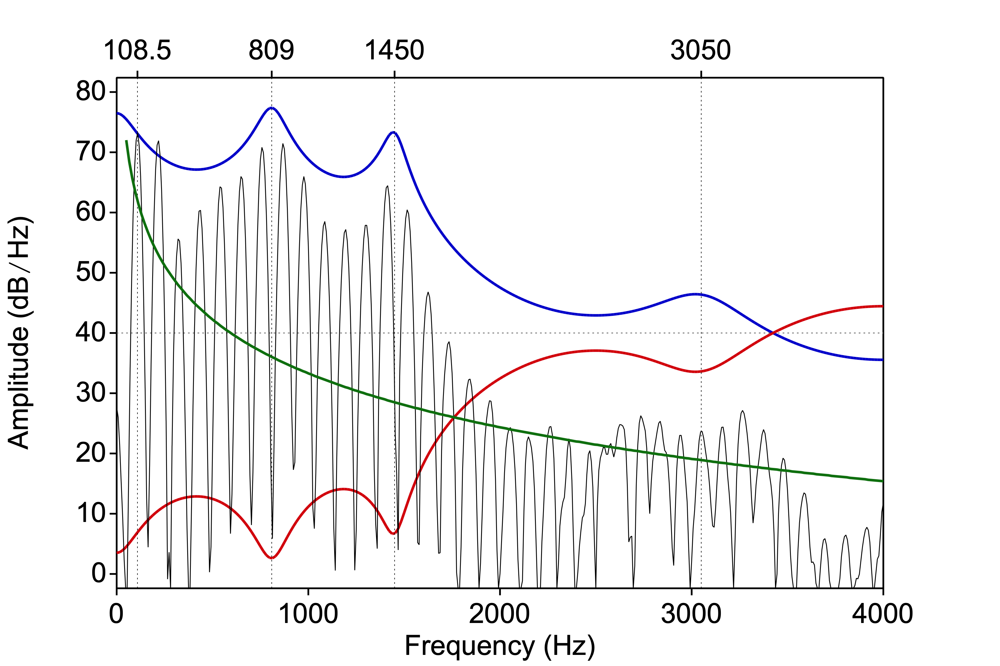

# Linear Predictive Coding {#ch-LPC}

*Chapter keywords*: Linear Predictive Coding, source-filter theory, source, filter, 
spectrum, time domain, frequency domain, 
fundamental, harmonics, formant, formant frequency, formant bandwidth, glottal source, phonation, noise, sampling frequency, gain, f0, pitch, frame, frame rate, window, window length. 

## Introduction

(with Clizia Welker)

Now that we know about spectra (§\@ref(sec:spectrum)) and about the source-filter theory of speech production (§\@ref(sec:sourcefilter)), we can discuss *Linear Predictive Coding* or *LPC*. While this analysis method is now over 50 years old (key references are @Atal_Hanauer_1971, @Atal_Schroeder_1978, @Markel_Gray_1976), it is still highly relevant and important today (@Story_2026) in speech research and telecommunication.

LPC is a method used to analyze and compress the spectral information in speech. The essentials of the LPC analysis will be explained below. LPC analysis achieves two major goals at the same time:

- The resulting parameters are far fewer in number than the original speech signal. Thus LPC reduces the bandwidth required to encode and transmit speech, which in turn allows for more telephone calls per bandwidth, hence cheaper phone calls. (As an indication, the data compression is by a factor of about 20).

- If done correctly, and with several caveats, (some of) the resulting parameters may be interpreted phonetically as formant frequencies and formant bandwidths.

## Inverse filtering {#sec:inversefiltering}

LPC works in the time domain (typically over a brief windowed portion of the input signal), but it is easier to explain in the frequency domain. @Story_2026 offers more detailed explanation and background. 

```{r a8000lpc, echo=FALSE, fig.cap="Spectrum of an [a] vowel, overlaid with (green) the assumed spectral slope of the glottal source, (red) the inverse LPC filter, and (blue) the resulting LPC spectral envelope", fig.align="center"}

```

To start, let us have a look at a spectral slice of a *vowel* [a], drawn in BLACK in Figure \@ref(fig:a8000lpc) (see also §\@ref(sec:spectralslice)). 
At the left we see the first harmonic, the fundamental frequency, at $f_0 = 108.5\,\textrm{Hz}$. The other harmonics are multiples of the fundamental (see §\@ref(sec:FTintro)): the *frequencies* of the harmonics are therefore entirely redundant, once we know that this is a voiced (periodic) sound with this $f_0$. These two relevant LPC parameters are named `F0` and `VUV` (voiced\~unvoiced). We also need to know the overall `Gain` (amplitude) of the input signal.

Moreover, we also assume that the glottal (voice) source sound itself has a particular spectral shape, *before* it enters into the filter (vocal tract). Presumably, the overall spectral slope of the glottal (voice) source sound is $-6\, \textrm{dB} / \textrm{octave}$, here drawn in GREEN [^ch08lpc-1] [^ch08lpc-2].

[^ch08lpc-1]: The glottal source signal has a presumed slope of $-12\, \textrm{dB} / \textrm{octave}$. This spectral slope is combined with the effect of the radiation of the speech sound at the lips. Radiation or spreading of sound works better for higher frequencies than for low frequencies (that is one of the reasons why loudspeakers for low frequencies tend to be larger and consume more energy than those for high frequencies): this radiation effect is $+6\, \textrm{dB} / \textrm{octave}$. For faster computation, we combine the effect of radiation into that of the glottal source, then the combined spectral slope is $-12+6 = -6$ $\textrm{dB} / \textrm{octave}$, and then we may subsequently ignore the radiation effect.

[^ch08lpc-2]: The curved shape of the GREEN contour in Figure \@ref(fig:a8000lpc) is due to the linear scale on the frequency axis, combined with the logarithmic shape of the filter envelope (octave).

However, what is *not* expected from the glottal source sound is (are) the major peaks in the spectral envelope at approximately 800, 1450 and 3000 Hz. As we now know, those peaks are caused by the acoustic filter, that is, by formant resonances in the vocal tract (§\@ref(sec:sourcefilter), §\@ref(sec:formants)). 
LPC attempts to determine the difference between the predicted spectrum from the source (GREEN) and the actual spectrum of the signal, by means of so-called "inverse filtering". This means that the effect of the vocal tract filter is "undone" in order to approximate the spectral envelope that we expect (GREEN): we expect no peaks (GREEN), but we do observe a peak (in the input spectrum, affecting several harmonics), so the inverse filter must suppress that peak at the peak frequency (RED).

Once we have done this inverse filtering, the coefficients of the resulting inverse filter (RED) may be re-interpreted as formant frequencies (and formant bandwidth), albeit with some caution. This is shown in the BLUE spectral envelope.

Finally, as a check, we can pipe the *presumed* glottal source signal (GREEN) with the proper `F0` and `Gain` into the filter, and compare the output of the filter (the predicted output speech, BLUE) with the original (BLACK). The difference between these two is termed the *residual* 
^[The actual procedure is computationally different but conceptually similar.]. 
If all has gone well, then according to the source-filter theory, the prediction should come out close to the original, and then the residual should contain only little information (buzz, noise or silence). In practice, however, the residual often contains salient phonetic properties of the speech. One reason for this is that the source and the filter are presumed to be independent in theory (e.g. formant frequencies are independent of `F0`) but this assumption does not always hold. Female voices in particular tend to have stronger coupling or interference between source and filter than male voices (@Titze_2008, @Klatt_Klatt_1990).

The LPC inverse filtering as described above is performed on a brief windowed portion or *frame* of the speech signal. Traditionally this was done over 256 samples, or 25.6 ms of speech if sampled at $f_s = 10\  \textrm{kHz}$ (§\@ref(sec:samplingfrequency)). Within this frame, LPC assumes correctly that the filter is stable, as the vocal tract does not change much during 25.6 ms, and it assumes that the fine spectral details (e.g. harmonics) must have been caused by the source. Thus the source and filter characteristics are separated for this brief time frame. Next, the analysis frame is moved forward, typically by 10 ms (`frame rate`), and the analysis repeats for the next frame.

In this section, we have described LPC analysis (inverse filtering) for voiced vowels. This is because the source-filter theory applies better to vowels than to consonants. In the case of *unvoiced consonants*, similar principles do apply, using a similar conceptualisation. For unvoiced consonants, the LPC analysis assumes that the source sound is white noise (§\@ref(sec:noise)) generated somewhere in the vocal tract, with a flat spectral envelope. In *voiced consonants*, _two_ source sounds are produced simultaneously: both the periodic phonation sound at the glottis, and the aperiodic noise at the constriction or closure. LPC has problems accounting for these two effects at the same time, and consequently, the residual still contains a lot of phonetic information: voiced consonants thus are rather unsuitable for LPC analysis. Consequently, the formants identified by LPC in consonants are less reliable than those in vowels.

## Limitations and considerations {#sec:LPC-details}

- As indicated above, LPC models the spectral envelope by a *set of formant-like peaks*, where frequencies are amplified. LPC cannot represent so-called anti-formants, where frequencies are actively attenuated. These antiresonances do occur in nasals, nasalized vowels, laterals, and fricatives. LPC is not very suitable for the spectral analysis (nor the transmission) of these categories of speech sounds.

- As indicated above, LPC assumes that the *source and filter are two independent systems* in series  (§\@ref(sec:sourcefilter)). 
If there is *interaction* between the source signal and the filter then the resulting LPC coefficients may be incorrect. This may happen between `F0` and the first formant in high vowels, in particular for women and children, or it may happen between formants (e.g. `F1` and `F2` in [u]) (@Titze_2008). 

- In traditional implementations, LPC will find a fixed (but user-settable) number of spectral filter coefficients that together model the spectral envelope. With some precautions, these LPC coefficients can be rearranged into peak frequencies and bandwidths of formants, 'using' two coefficients per formant (see §\@ref(sec:formants) for background about formants). 
The *chosen number of formants in the LPC analysis must match the sampling frequency*, and it is the task of you, the analyst, to ensure that these properties do match. 
For adult male speakers, the formants are spaced about 1000 Hz apart (see §\@ref(sec:formants)). So if you expect\|want to find 5 formants (10 spectral LPC coefficients) in male speech, the frequency range should be 0 to 5000 Hz, and the corresponding sampling frequency should be twice the upper limit, hence $f_s = 5 \times 1000 \times 2 = 10000$ Hz (see §\@ref(sec:samplingfrequency) about sampling frequency, esp. for the $\times 2$ part of this rule)^[In other words, the number of LPC coefficients should be the sampling frequency $f_s$ in kHz (@Story_2026)]. 
For adult female speakers, the formants are spaced about 1100 Hz apart. If you expect\|want to find 5 formants in female speech, the corresponding sampling frequency should be $f_s = 5 \times 1100 \times 2 = 11000$ Hz.

  Consequently, you must ensure that the number of formants found by the LPC analysis matches the sampling frequency of the input speech signal. This can be achieved in two ways:

  - by choosing the *number of formants* in the LPC analysis proportional to the sampling frequency: the number of formants should be $f_s/2/1000$ for male speech ^[or: the number of LPC coefficients should be $f_s/1000$ or $f_s$ in kHz, as suggested above.] and $f_s/2/1100$ for female speech;

  - by setting the *sampling frequency* $f_s$ (see §\@ref(sec:samplingfrequency)) proportional to the desired number of formants, that is, by *downsampling* the speech signal to an $f_s$ that is appropriate for the desired number of formants. (For Figure  \@ref(fig:a8000lpc), the speech was downsampled to 8 kHz before LPC analysis, as there were only 4 formants noticeable in the original vowel from a male speaker.)\

  If you fail to respect this relation between number of formants and sampling frequency, then the LPC analysis may result in spurious formants (a spectral peak is incorrectly considered to be a formant^[Such spurious formants may have a very wide bandwidth, and thus a very low quality.]) or in missed formants (so that e.g. the actual F4 is reported as `F3` because the true F3 has been missed). 
  For an example of this "formant confusion", see Figure \@ref(fig:window-soundeditor-3), in the last 5 frames within the selection.
  
  In more advanced implementations, as in `Praat` (`To Formant (burg)...`), the number of formants reported is independent of the sampling frequency, and such "formant confusion" is kept under control. 
  
  Remember that the number of coefficients in the LPC analysis is twice the number of formants, because _two_ coefficients (peak frequency and bandwidth) are required to describe _one_ formant in the LPC spectrum (BLUE). 

::: {#box-praatlpc1 .praatbox}

## How to perform LPC analysis

### LPC analysis {#sec:LPC-analysis}

`Praat` has several algorithms to perform an LPC analysis. The classical LPC algorithm as described above uses the `autocorrelation` method (@Markel_Gray_1976). For phonetic analysis, where you typically want to interpret the LPC coefficients in terms of formants (frequencies and bandwidth), the `burg` method is more appropriate (and it is the recommended method in `Praat`); here we will indeed follow the `burg` method. 

:::

<P>

::: {#box:bypassLPC .warningbox}

If you are only interested in the formant values, then the recommended workflow is to entirely *bypass the LPC analysis* as described in this chapter. Instead, go directly from Sound to Formants, as explained in §\@ref(sec:measureformants). 
`Praat` will then take care of the limitations and considerations and complications in the LPC analysis, generally with good results. However, if your formant analysis yields unexpected or implausible results, then the LPC considerations in this chapter may help you find solutions. 

::: 

<P>

::: {#box-praatlpc2 .praatbox}

* Select an input Sound object in the `Praat` Objects window. 

* Choose `Analyze Spectrum... > To LPC... > To LPC (burg)...`. 

   - `Prediction order` refers to the desired number of LPC coefficients, which is twice the number of desired formants, taking the sampling frequency $f_s$ into account (see above).
   
   - `Window length` determines the time in seconds of the analysis window; the acoustic filter is assumed to be stable during this time, while the window contains several periods of the speech signal. `Praat`'s default value of 0.025 s is usually OK. 
   
   - `Time step` determines by how much the LPC analysis window is shifted between consecutive steps (good values are 0.005 or 0.010 s).
   
   - `Pre-emphasis frequency`: This emphasis filter flattens the downward slope of the spectral envelope, so that spectral information in the higher frequencies is boosted (so that the higher frequencies are well represented in the output LPC coefficients). Here you can set the cutoff frequency of this filter; it's best to leave this at 50 Hz (somewhat below the lowest speech frequency). For more background, see §\@ref(sec:emphasisfilters). 

Then click OK. This will result in an LPC object: a series of LPC spectra, one for each frame (at `time step` intervals and with the chosen frame `length`). 

- Remember to `Save` the LPC object if you wish. 

### Formants

From the LPC object, you can extract formant information by choosing `To Formant`. 

- You may then `Draw` or `Tabulate` or interactively `Query` the resulting formant values (frequencies and bandwidths per formant per time frame). 

- Remember to `Save` the Formant object if you wish. 


### Spectral slice {#sec:LPC-spectralslice}

From the LPC object, you can also extract a spectral slice (a spectrum at a particular time) by choosing `To Spectrum (slice)...` Use the same values for deemphasis as you chose for `preemphasis` in the analysis. 

The resulting Spectrum object contains a typical LPC spectrum, which (ideally) represents the smoothed spectral envelope of the filter, irrespective of the source signal. For more background about spectra, see §\@ref(sec:spectrum). 

- You may then `Draw` this spectrum (spectral slice), perhaps combined with the spectrum of the input signal, as in Figure \@ref(fig:a8000lpc) above (in blue). Or you can inspect it interactively (`View & Edit`) as any spectrum. 

### Extract residual 

To check the LPC analysis, you may compute the _residual_ from the original sound and the LPC spectrum (see §\@ref(sec:inversefiltering) above). 
Select both the Sound and the LPC object (use Command+click to select two objects). 
Then choose `Filter (inverse)...` 

The resulting Sound equals the input Sound "minus" the LPC smoothed filter (i.e., the input Sound filtered by the LPC filter), for each frame. 
Ideally, the residual should contain little or no phonetic information: it should be difficult to comprehend it and difficult to recognize the speaker. 
In practice, the residual often does contain relevant phonetic information.

You may also inverse-filter the entire input Sound with the LPC spectrum at a particular time (frame). This may be helpful to assess possible "formant confusion" as described above (§\@ref(sec:LPC-details) above).

:::
