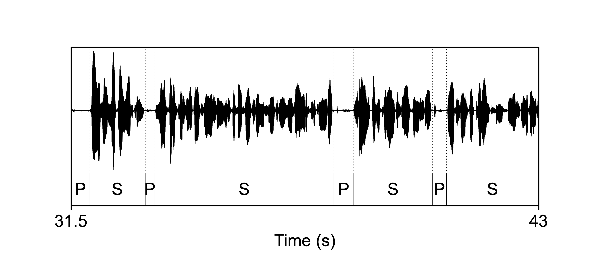

# Prosody {#ch-prosody}

*Chapter keywords*: TODO . 

## Introduction

*Prosody* is the collective term for the 'musical' properties of speech, which are typically established not by the sequence of speech sounds, but over larger units of speech (@Nooteboom_1997): these are also termed *suprasegmental* properties (or, *suprasegmentals* as a plural noun, @Lehiste_1970). Among these prosodic properties are: \
- the distribution of **pauses**, \
- speech **tempo** (speed, rate), \
- **durations** of speech sounds (§\@ref(sec:howtoannotate)), \
- **tone** and **intonation** of voice pitch  (§\@ref(sec:frequency), §\@ref(sec:FTintro)),\
- **intensity** and loudness (§\@ref(sec:amplitude)),\
- **stress** or prominence, \
- **accentuation** or emphasis of important words,\
- **rhythm**, \
- and **voice quality**. 

Broadly speaking, these properties of everyday speech are seldom captured in regular writing, and we need additional symbols such as *punctuation* (@Parkes_1992), *emoji* and *accented letters* to capture these phonetic properties in writing. (In itself, the existence and widespread use of these additional symbols illustrate the importance of prosody in speech communication.)

Unfortunately, there are no simple 1:1 relations between prosodic and acoustic properties. For example, in some languages such as English and Dutch, one syllable in a polysyllabic word carries more *stress* than the others: this is conveyed by segment duration, loudness, as well as pitch, in varying degrees of importance. Similarly, *phrasing* is achieved by means of pausing, intonation, and/or tempo changes. And *rhythm* is established by intricate combination of timing (durations) and prominence patterns. In the other direction, the duration of a vowel depends on many linguistic and phonetic factors, such as its position within its phrase and word and syllable, the stress status of the syllable, the accent status of the word, and more (@Klatt_1976). 

In this chapter, we will focus on the measurement and analysis of these prosodic properties of speech. Some of these properties can be manipulated too, as we will discuss in the next chapter. 

## Pauses and tempo

### Pausing

Typical speech contains **pauses**, which may serve multiple functions: (1) pauses are used to demarcate linguistic units in spoken language, (2) pauses occur naturally whenever speakers inhale fresh air, (3) speakers may pause their own speech if they need extra preparation time for what they wish to say, (4) rhetorical purposes. (For a review, see @Fletcher_2010). In practice, these functions may interfere: for example, a speaker may pause *within* a linguistic unit (contra 1), perhaps to select the appropriate word (see Fig.\@ref(fig:s344f5-pausing) for an example). Or a speaker may produce a filled pause (contra 2) for some rhetorical or communicative purpose. 

Whenever a voiceless plosive (or click) sound is produced, there is a brief silent interval in the speech signal: there is neither voicing at the larynx, nor consonantal sound produced elsewhere in the vocal tract.
(As an example, see the voiceless plosive [p] in the oscillogram in Fig.\@ref(speech-oscillogram).)
Such silent intervals have only a brief duration, however, which makes them different from more deliberate "real" pauses (that are not due to articulation). 
Phoneticians typically set the threshold at about 0.25 seconds (e.g. @DeJong-Bosker-2013): brief silent intervals shorter than this threshold are regarded as being due to articulatory reasons (and thus as irrelevant for prosody), whereas longer silent intervals are regarded as true pauses that are prosodically, phonetically, and/or communicatively meaningful.  

Pauses are typically measured in their frequency of occurrence and/or in their duration:

- number of pauses per minute or per second, 
- number of pauses per minute or per second *of speech* time, 
- the average (or median) duration of pauses, in seconds or after log-transformation (see §\@ref(sec:logarithm)).

Some pauses are silent, but a speaker may typically produce a so-called "filled pause", filled with a prolonged mid central schwa-like vowel "eh" /ə/ or "er" /ɚ/ or syllabic consonant "um" /m/ (@Clark_FoxTree_2002). The sound being used may convey pragmatic meaning, e.g. about the duration of the upcoming delay (@FoxTree_2001) or about the speaker's desire to hold the floor. Moreover, the filled pause sound may differ (statistically) between languages, and speakers may adjust their filled pause sound to the target language (@deBoer_Quené_Heeren_2022). 

::: {#box-LTSF .praatbox}

`Praat` helps us to discriminate between speech and pauses automatically. This task is often called *voice activation detection* (VAD). Here we demonstrate the `LTSF` method of VAD, which looks at the Long Term Spectral Flatness. Typical speech does not have a flat spectrum, so whenever the spectrum is flat (according to some threshold of flatness), it may not be speech. 

(1) Open the speech recording to analyze as a Sound object (see §\@ref(sec:praatopen)).

(2) Choose the button `Annotate >` and then choose `To TextGrid (speech activity, LTSF)...` 
Leave the numerical parameters at their standard values, and press `OK`. 
The LTSF speech activity detector will create a TextGrid to store the resulting annotation. See   §\@ref(sec:textgrids) for help about TextGrids).

(3) Select *both* the Sound and corresponding TextGrid objects; in order to select multiple objects from the list, press `Command` while selecting objects.

(4) Choose the button labeled `View & Edit`; this will open a TextGridEditor window. For details about the TextGridEditor, see §\@ref(sec:howtoannotate) and references given there. 
Check the results of speech activity detection, and re-do the analysis with different (nonstandard) values if necessary. 

Figure \@ref(fig:s179f1wolf) shows an example of a TextGrid annotating speech activity; it shows an oscillogram of 11.5 seconds of speech (S) and intermediate pauses (P). 

```{r s179f1wolf, echo=FALSE, fig.cap="Speech activity as detected using LTSF method, discriminating between speech (S) and pauses (P).", fig.align="center"}

```

:::

::: {#box-s344f5_pausing .smallprintbox}
The oscillogram and annotation in Fig.\@ref(fig:s179f1wolf) shows part of a spoken sentence, taken from the interview recording named `s179f1_1.wav` from the LUCEA corpus. The sentence is taken from the "wolf story" part of the interview. For details about the corpus, see @Orr_Quené_2017. 
:::

::: {#box-Queryintervaltier .praatbox}
From the TextGrid containing the speech activity results, we can now easily retrieve the number and duration of pauses. 

(1) Select the TextGrid containing the speech activity results. Here we will assume that speech has been labeled as "S" and pauses as "P", as above. 

(2) To obtain the total duration: 
`Query > Query time domain... > Get total duration`. 

(3) To obtain the number of pauses: 
`Query > Query interval tier > Count intervals where...`
Enter the appropriate tier number and the label for pauses. The number of matching intervals is reported in the Info window. 

(4) To obtain the duration of the pauses: 
`Query > Query interval tier > Get total duration of intervals where...`
Enter the appropriate tier number and the label for pauses. The total duration of matching intervals is reported in the Info window. 
:::

From the resulting output we can easily calculate the pausing measures for this particular recording:

- 21 pauses in $57.591$ seconds gives 0.36 pauses per second;
- 21 pauses in $49.32$ seconds of speech time gives 0.42 pauses per second of speech time;
- average duration of pauses is $8.271/21 = 0.393$ s;
- average duration of speech intervals (between pauses) is $49.32/20 = 2.466$ s;
- pause time makes up 14\% of the total time ($8.271/57.591$), close to the value of 10\% to 15\% reported in phonetics texts. 


### Tempo

Figure \@ref(fig:s344f5-pausing) shows a sentence from a monologue (with preceding inhalation pause). The speaker pauses for 0.580 seconds in the middle of this sentence, possibly to search for the appropriate words to continue. 

```{r s344f5-pausing, echo=FALSE, fig.cap="Oscillogram and annotation of the sentence *Yeah you can you can really see how.... how diff'rent th'approaches of the students involv'd were.*", fig.align="center"}
knitr::include_graphics("figures/s344f5_formal_fragment.png")
```

::: {#box-s344f5_pausing .smallprintbox}
The oscillogram and annotation in Fig.\@ref(fig:s344f5-pausing) shows a spoken sentence, taken from the interview recording named `s344f5_1.wav` from the LUCEA corpus. The sentence is taken from the formal monologue part of the interview. For details about the corpus, see @Orr_Quené_2017. Some vowels are strongly reduced, as indicated in the caption. The first phrase contains 9 realized syllables, and the second phrase 13. 
:::

The durations of the pauses and phrases of the target fragment are listed below. In practice, such tables will contain many more rows of data. 

```
1.132 pause 1   1.132  
1.659 phrase 1          1.659    8
0.580 pause 2   0.580
3.603 phrase 2          3.603   13
6.974 total     1.712   5.262   21
```


From Table X we may calculate that the **speaking rate** or **speech rate** or **tempo** (including pause time) is 21 syllables in 6.974 seconds, or 3.0 syllables per second. The **articulation rate** (excluding pause time) is 21 syllables in 5.262 seconds, or 4.0 syllables per second. 

## Durations

## Frequency (pitch)

## Intensity (loudness)

## Stresses and accents

## Rhythm

## Voice quality

TBA

