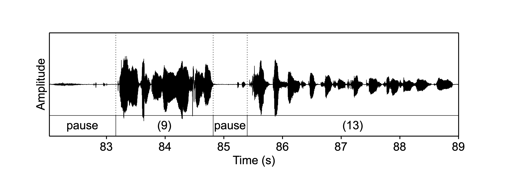

# Prosody {#ch-prosody}

*Chapter keywords*: TODO . 

## Introduction

*Prosody* is the collective term for the 'musical' properties of speech, which are typically established not by the sequence of speech sounds, but over larger units of speech (@Nooteboom_1997): these are also termed *suprasegmental* properties (or, *suprasegmentals* as a plural noun, @Lehiste_1970). Among these prosodic properties are: \
- the distribution of **pauses**, \
- **tone** and **intonation** of voice pitch  (§\@ref(sec:frequency), §\@ref(sec:FTintro)),\
- **durations** of speech sounds (§\@ref(sec:howtoannotate)) and speech **tempo**,\
- **intensity** and loudness (§\@ref(sec:amplitude)),\
- **stress** or prominence, \
- **accentuation** or emphasis of important words,\
- **rhythm**, \
- and **voice quality**. 

Broadly speaking, these properties of everyday speech are seldom captured in regular writing, and we need additional symbols such as *punctuation* (@Parkes_1992), *emoji* and *accented letters* to capture these phonetic properties in writing. (In itself, the existence and widespread use of these additional symbols illustrate the importance of prosody in speech communication.)

Unfortunately, there are no simple 1:1 relations between prosodic and acoustic properties. For example, in some languages such as English and Dutch, one syllable in a polysyllabic word carries more *stress* than the others: this is conveyed by segment duration, loudness, as well as pitch, in varying degrees of importance. Similarly, *phrasing* is achieved by means of pausing, intonation, and/or tempo changes. And *rhythm* is established by intricate combination of timing (durations) and prominence patterns. In the other direction, the duration of a vowel depends on many linguistic and phonetic factors, such as its position within its phrase and word and syllable, the stress status of the syllable, the accent status of the word, and more (@Klatt_1976). 

In this chapter, we will focus on the measurement and analysis of these prosodic properties of speech. Some of these properties can be manipulated too, as we will discuss in the next chapter. 

## Pauses and tempo

Typical speech contains **pauses**, which may serve multiple functions: (1) pauses are used to demarcate linguistic units in what is said, (2) pauses occur naturally whenever speakers breathe in fresh air, (3) speakers may pause their own speech if they need extra preparation time for what they wish to say, (4) rhetorical purposes.  
In practice, these functions may interfere: for example, a speaker may pause *within* a linguistic unit (contra 1), perhaps to select the appropriate word (see Fig.\@ref(fig:s344f5-pausing) for an example). Or a speaker may produce a filled pause (contra 2) for some rhetorical or communicative purpose. 

Whenever a voiceless plosive (or click) sound is produced, there is a brief silent interval in the speech signal: there is neither voicing at the larynx, nor consonantal sound produced elsewhere in the vocal tract. Such silent intervals have only a brief duration, however, which makes them different from more deliberate "real" pauses (not due to articulation). 
Phoneticians typically set the threshold at about 0.25 seconds: brief silent intervals shorter than this threshold are regarded as articulatory (and thus as irrelevant for prosody), whereas longer silent intervals are regarded as pauses that are prosodically, phonetically, and communicatively relevant. 

Short silent intervals occur whenever a voiceless plosive is realized, e.g. for a [p] (see Fig.\@ref(speech-oscillogram) for an example). 
The lower threshold for a speech pause is often chosen to be 0.25 seconds (@DeJong-Bosker-2013). 

Shorter intervals may occur as a

In typical speech production, air from the lungs is used to produce speech sounds. After a while, there is insufficient 

TODO welke kenmerken van pauzering, zie Bosker et al. 

TODO Praat: silence, VAD, speech

```{r s344f5-pausing, echo=FALSE, fig.cap="Oscillogram and annotation of the sentence *Yeah you can you can really see how.... how diff'rent th'approaches of the students involv'd were.*", fig.align="center"}

```

::: {#box-s344f5_pausing .smallprintbox}
The oscillogram and annotation in Fig.\@ref(fig:s344f5-pausing) shows a spoken sentence, taken from the interview recording named `s344f5_1.wav` from the LUCEA corpus. The sentence is taken from the formal monologue part of the interview. For details about the corpus, see @Orr_Quené_2017. Some vowels are strongly reduced, as indicated in the caption. The first phrase contains 9 realized syllables, and the second phrase 13. 
:::

Figure X shows a sentence from a monologue (with preceding inhalation pause). The speaker pauses for 0.580 seconds in the middle of this sentence, possibly to search for the appropriate words to continue. The durations of the pauses and phrases of the target fragment are listed in Table X. In practice, such tables will contain many more rows of data. 

```
1.132 pause 1   1.132  
1.659 phrase 1          1.659    8
0.580 pause 2   0.580
3.603 phrase 2          3.603   13
6.974 total     1.712   5.262   21
```

### Pausing

### Tempo

From Table X we may calculate that the **speaking rate** or **speech rate** or **tempo** (including pause time) is 21 syllables in 6.974 seconds, or 3.0 syllables per second. The **articulation rate** (excluding pause time) is 21 syllables in 5.262 seconds, or 4.0 syllables per second. 

## Durations

## Frequency (pitch)

## Intensity (loudness)

## Stresses and accents

## Rhythm

## Voice quality

TBA

